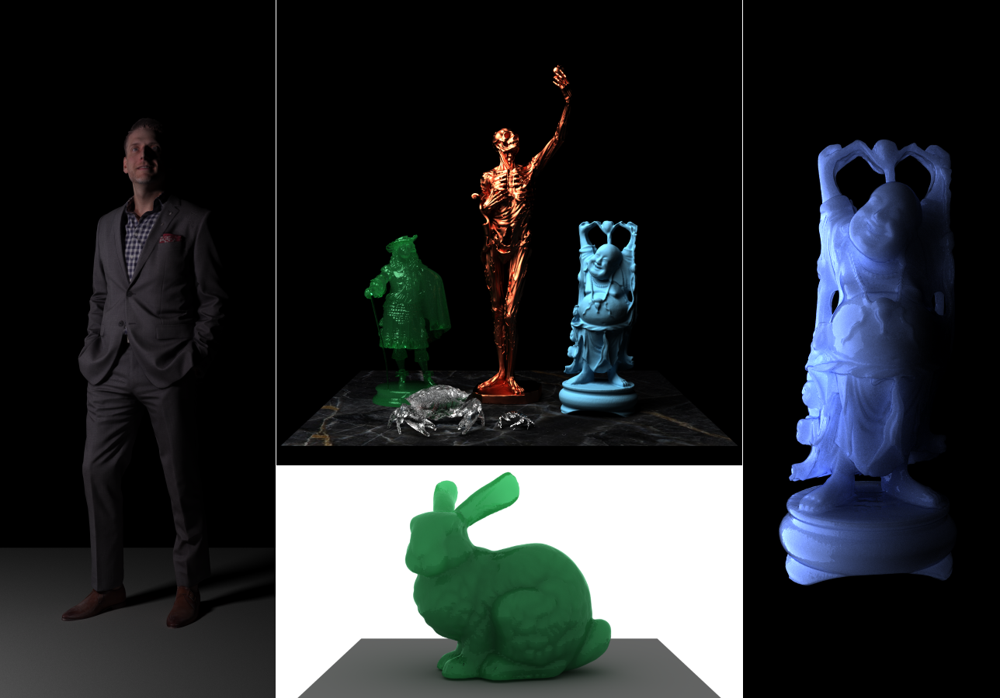
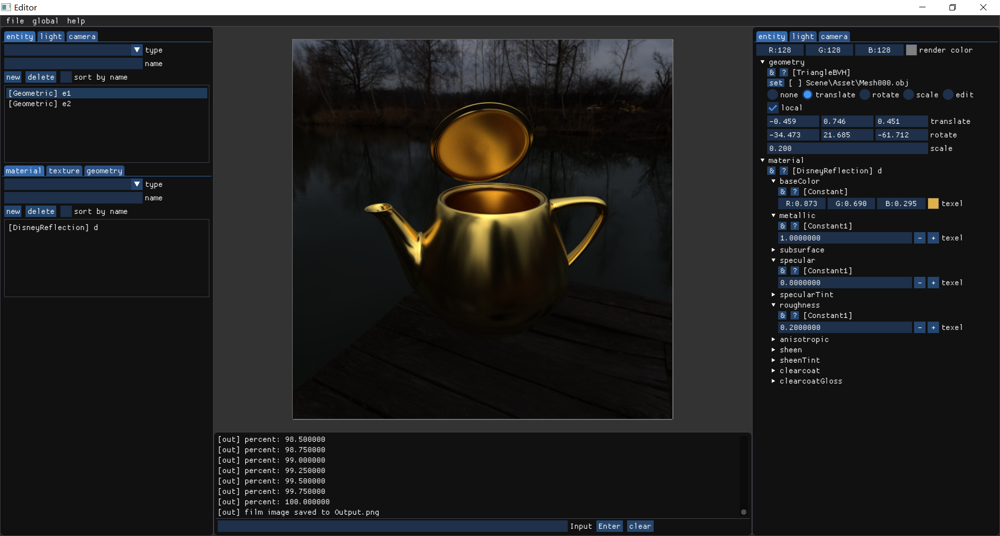

# Atrc

Atrc是[Z Guan](https://github.com/AirGuanZ)的渲染实验室，主要以C++编写，包含以下组件：

- [x] Core 离线渲染核心组件库，包含各种实体、材质模型和常见渲染算法，会随着我的学习不断扩展/重构
- [x] Mgr 用于管理核心组件的辅助库，根据配置字符串创建各种类型的核心组件中的对象（如模型、摄像机、灯光等）
- [x] Launcher 渲染器启动器
- [x] SH2D 将场景、灯光投影到1~5阶球谐函数系数，以及旋转球谐系数、根据球谐系数重建图像的工具
- [x] Editor 场景编辑器，相当于Launcher的前端
- [ ] EnvLight 倒腾环境光的工具，如各种映射间的转换等（施工中）

Atrc已/将实现以下特性：

- [x] [Core] 多种几何模型，如球体、三角形、OBJ格式的网格等
- [x] [Core] 快速构建BVH加速数据结构，已构建的BVH树会被自动缓存至`.agz.cache`中
- [x] [Core] Disney Principled BRDF，Oren-Nayar漫反射模型，玻璃，黑体等多种材质模型
- [x] [Core] Microfacet Transmission BSDF
- [x] [Core] Normalized Diffusion BSSRDF
- [x] [Core] 几何漫射光源和支持HDR贴图的环境光
- [x] [Core] Gamma校正和简单的Tone Mapping
- [x] [Core] Box、Gaussian等Windowed Film Filter
- [x] [Core] 支持体渲染、多重重要性光照采样等特性的Path Tracing
- [x] [Editor] 实时编辑待渲染的场景，包括设置材质、几何体、光源、摄像机和各项渲染参数等
- [x] [Editor] 导出和加载可被Launcher读取并用于渲染的场景描述脚本，也可在编辑器中直接进行渲染
- [x] [SH2D] 将场景/环境光投影到1~5阶球谐函数上
- [x] [SH2D] 从场景和环境光的球谐函数系数重建出图像，支持环境光系数的旋转
- [ ] [Editor] 重构Editor（施工中）
- [ ] [Core] Progressive Photon Mapping（学习中）
- [ ] [Core] Bidirectional Path Tracing
- [ ] [Core] Disney Pincipled BSDF

下图为部分渲染结果，模型主要来自[3D Scans](http://threedscans.com/)和[Stanford 3D Scanning Repository
](http://graphics.stanford.edu/data/3Dscanrep/)，所有场景和渲染参数均通过配置文件指定：



## Build

Atrc使用了大量C++17特性，因此只能用版本较新的编译器构建。我所使用的测试环境为：

```
[VS2017], [g++ 8.2.0], [clang 8.0.0]
```

Atrc依赖于[glfw](https://www.glfw.org/)、[glew](http://glew.sourceforge.net/)、[dear imgui](https://github.com/ocornut/imgui)以及[AGZ Utils](https://github.com/AirGuanZ/Utils)。其中[glfw](https://www.glfw.org/)和[glew](http://glew.sourceforge.net/)需要提前安装，[dear imgui](https://github.com/ocornut/imgui)已包含在源代码中，[AGZ Utils](https://github.com/AirGuanZ/Utils)则是该`Atrc`仓库的子模块，可以通过`git`的`--recursive`选项自动`clone`。以产生`VS2017 x64 Solution`为例，首先移动到要放置项目的目录下，在`Powershell`中输入：

```powershell
git clone --depth=1 --recursive https://github.com/AirGuanZ/Atrc.git
cd Atrc
mkdir Build64
cd Build64
cmake -G "Visual Studio 15 2017 Win64" ..
```

如果环境正确，此时应该可以在`Build64`目录中找到项目的解决方案文件`Atrc.sln`。

## Scene Configuration

Atrc::Mgr用[Utils::Config](https://github.com/AirGuanZ/Utils/blob/master/Src/AGZUtils/Config/Config.h)来解析配置文件中的字符串，Atrc::Launcher利用Atrc::Mgr来从文件中读取完整的场景描述信息。由于配置文件的编写对使用者极不友好，Atrc::Editor作为一个简单易用的场景编辑工具，提供了加载/导出场景描述脚本的功能，也可在编辑器中直接渲染图像。截图如下（场景来自[这里](https://tieba.baidu.com/p/5849022433)）：


