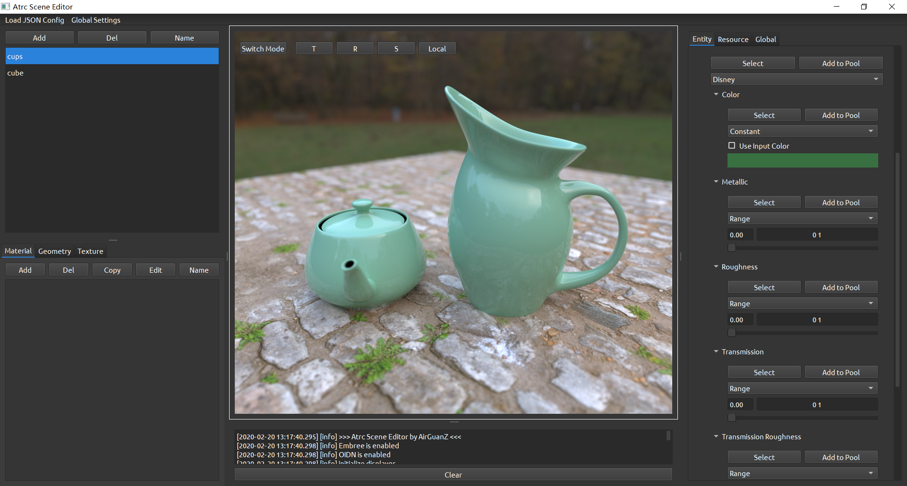

# Atrc

Offline rendering lab based on ray tracing

## Features

- [x] volumetric path tracing, adjoint particle tracing, bidirectional path tracing, stochastic progressive photon mapping, pssmlt on path tracing
- [x] materials: disney bsdf, mirror, phong...
- [x] (optional) integrated [Embree](https://github.com/embree/embree) engine
- [x] (optional) integrated [OIDN](https://github.com/OpenImageDenoise/oidn) denoiser

## Roadmap

- [x] Post Processor editing in editor
- [ ] MMLT
- [ ] VCM

## Documentation

[doc](https://airguanz.github.io/atrc_doc/doc.html)

## Gallery

Scene Editor (under development) (scene ref [here](https://luxcorerender.org/download/)):

Materials:

Fireplace Room (scene ref [here](http://casual-effects.com/data/index.html)):

DoF:

