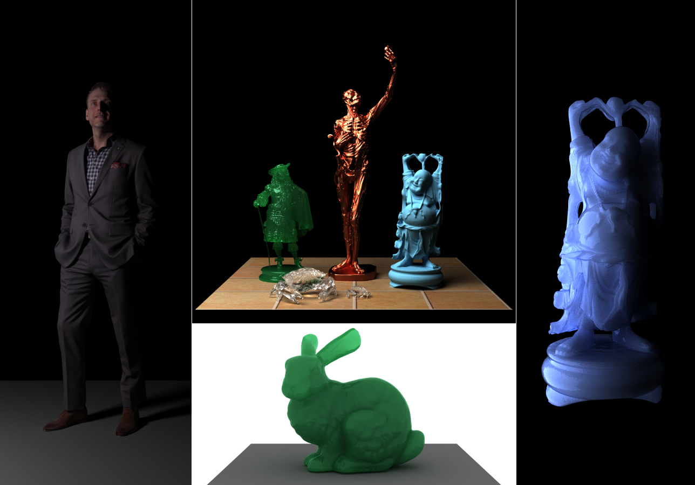
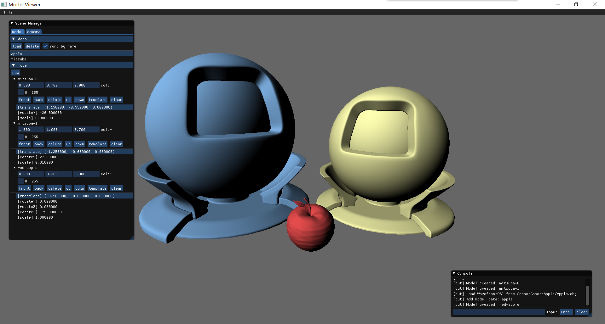

# Atrc

Atrc是[Zhuang Guan](https://github.com/AirGuanZ)的渲染实验室，主要以C++编写。Atrc（将会）包含以下组件：

- [x] Lib 离线渲染核心组件库，包含各种实体、材质模型和常见渲染算法，会随着我的学习不断扩展/重构
- [x] Mgr 用于管理核心组件的辅助库，根据配置字符串创建各种类型的核心组件中的对象（如模型、摄像机、灯光等）
- [x] Launcher 渲染器启动器
- [x] SH2D 将场景、灯光投影到1~5阶球谐函数系数，以及旋转球谐系数、根据球谐系数重建图像的工具
- [ ] ModelViewer 模型查看器，可能进化为Launcher前端。（施工中）

Lib已/将实现以下特性：

- [x] Volumetric Path Tracing
- [x] Torrance-Sparrow Reflection Model & Oren-Nayar Reflection Model
- [x] Normalized Diffusion BSSRDF
- [ ] Torrance-Sparrow Transmission Model
- [ ] Disney BRDF
- [ ] Progressive Photon Mapping
- [ ] Bidirectional Path Tracing

下图展示了部分渲染结果，模型主要来自[3D Scans](http://threedscans.com/)和[The Stanford 3D Scanning Repository
](http://graphics.stanford.edu/data/3Dscanrep/)，所有场景和渲染参数均通过配置文件指定：



ModelViewer目前还在早期施工中，截图如下：



## Build

ModelViewer依赖于[glfw](https://www.glfw.org/)、[glew](http://glew.sourceforge.net/)以及[dear imgui](https://github.com/ocornut/imgui)，此外所有组件均依赖于工具库[AGZ Utils](https://github.com/AirGuanZ/Utils)。

Atrc使用了大量C++17特性，因此只能用版本较新的编译器构建。`./Build/VS2017/Atrc`中包含了可以用VS2017打开的解决方案；在*nix下可使用clang/gcc编译，输入命令`make all`即可。我所使用的测试环境为：

```
VisualStudioVersion = 15.0.28010.2048
g++ 8.2.0
clang 8.0.0
```

## Configuration Script

Atrc::Mgr用[Utils::Config](https://github.com/AirGuanZ/Utils/blob/master/Src/Config/Config.h)来解析配置文件中的字符串。以下是一个可供`Launcher`使用的配置文件示例，它使用路径追踪算法渲染一个翡翠质感的苹果模型（包含内部的介质散射和吸收）：

```
# Lines starting with character '#' are comments

# Set the default directory for loading resources
# '@' means this path is relative to the parent directory of script file
workspace = "@Asset/Test/";

# Specify the output film property
film = {
    # Pixel size of the film
    size = (600, 600);
    # Specify the filter used to reconstruct the image
    filter = {
        type   = Gaussian; # Use windowed gaussian filter
        radius = 1.5;      # Size of the filtering window
        alpha  = 2;        # Parameter of gaussian function
    };
};

# Specify the output filename
# '$' means the path is relative to the working directory of the renderer process
outputFilename = "$Output.png";

# Specify sampling strategy for each pixel
sampler = {
    type = Native; # Simply wraps std::default_random_engine
    spp  = 100;    # Samples per pixel
};

# Specify the camera property
camera = {
    type = Pinhole;
    sensorWidth = 1;        # How large is the camera sensor in world space
    sensorDistance = 1.5;   # Distance between sensor plane and pinhole 
    pos = (-1.5, 0.2, 0.5); # Pinhole position
    lookAt = (0, 0, 0.25);  # Point looked at by the camera
    up = (0, 0, 1);         # Specify the profile rotation
};

# Specify the rendering strategy
renderer = {
    type = PathTracing;
    integrator = {
        type = Full;            # 'Full' means including medium rendering. BSSRDF will be supported soon
        minDepth = 10;          # Russian roulette will be used after path length is more than 10
        maxDepth = 200;         # Limit the maximal length of traced paths
        contProb = 0.9;         # Probability of continuing in russian roulette strategy
        sampleAllLights = True; # Whether sample all lights when computing direct illumination
    };
    # Set the working thread count. Specify non-positive value to use hardware thread count
    workerCount = 11;
    # The whole image was divided to many grid of specified pixel size.
    # Each grid will be assigned to a working thread as a independent rendering task
    taskGridSize = 16;
};

# Specify the rendering progress reporting strategy
reporter = { type = Default; };

# Entities in the rendered scene
entities = (
{
    type = Geometric;
    geometry = {
        type = TriangleBVH;         # A triangle BVH tree created from a Wavefront OBJ file
        filename = "Apple.obj";     # OBJ filename relative to workspace
        transform = (               # Transforms are applied from bottom to top
            Translate(0, 0, -0.95), # Translate 0.95 units along the negative Z direction
            RotateZ(Deg(250)),      # Rotate 250 degrees around Z axis
            Scale(2.5),             # Scale the object 2.5 times
        );
    };
    material = {
        type = IdealSpecular; # Ideal material with specular reflection and refraction
        rc = {                # Color texture
            type  = Constant;          # 'Constant' means all texels have the same color
            texel = (0.6, 0.95, 0.75); # Texel value
        };
        fresnel = {            # Fresnel property of the material
            type = Dielectric; # Use the dielectric fresnel equation
            etaI = 1;          # Outside refractive index
            etaT = 1.55;       # Inside refractive index
        };
    };
    medium = { # (Optional) Medium of the object
        in = { # Inner medium. Both 'in' and 'out' medium are optional
            type   = Homogeneous;
            sigmaA = (1);  # Absorption rate
            sigmaS = (10); # Scattering rate
            le     = (0);  # Self-illumination
            g      = 0.3;  # Non-symmetric factor
        };
    };
});

# Lights in the rendered scene
lights = {
    type = Environment;
    tex = {
        type     = HDR;         # Use HDR texture for environmental mapping
        filename = "Light.hdr"; # Specify the filename relative to workspace directory
        sampler  = Linear;      # Sample with bilinear interpolation
        wrapper  = Clamp;       # Clamp out-of-range texture coordinates to [0, 1]^2
    };
});

# Pinhole camera will flip the scene horizentally and vertically, so we need to flip the image again
postProcessors = ({ type = FlipImage; });
```
