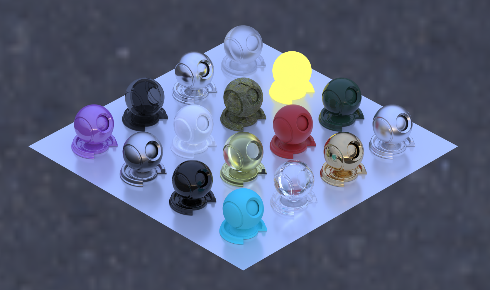
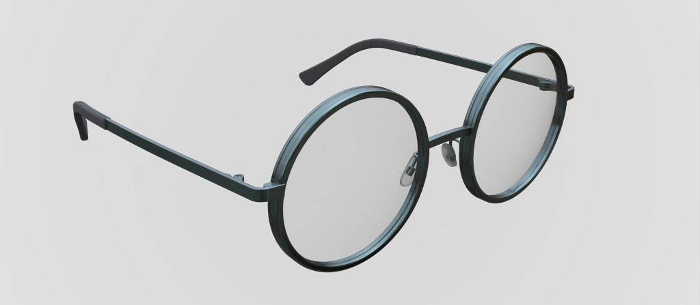

# Atrc

Offline rendering lab based on ray tracing

## Features

- [x] volumetric path tracing, adjoint particle tracing, bidirectional path tracing
- [x] materials: disney bsdf, mirror, varnish...
- [x] hdr texture
- [x] (optional) integrated [Embree](https://github.com/embree/embree) engine
- [x] (optional) integrated [OIDN](https://github.com/OpenImageDenoise/oidn) denoiser

## Roadmap

- [ ] refactor area light source as entity material
- [ ] impl material thumbnail in editor
- [ ] saving/loading in editor
- [ ] JSON exporter in editor
- [ ] more rendering algorithms: sppm, vcm, mlt, ...

## Documentation

[doc](https://airguanz.github.io/atrc_doc/doc.html)

[doc-cn](https://airguanz.github.io/atrc_doc/doc-cn.html) (in Traditional Chinese)

## Gallery

Scene Editor:

Materials:

Fireplace Room (scene ref [here](http://casual-effects.com/data/index.html)):

Glasses:

Volumetric Rendering (model ref [here](http://casual-effects.com/data/index.html)):

G-Buffer & Denoiser (model ref [here](http://graphics.stanford.edu/data/3Dscanrep/)):

