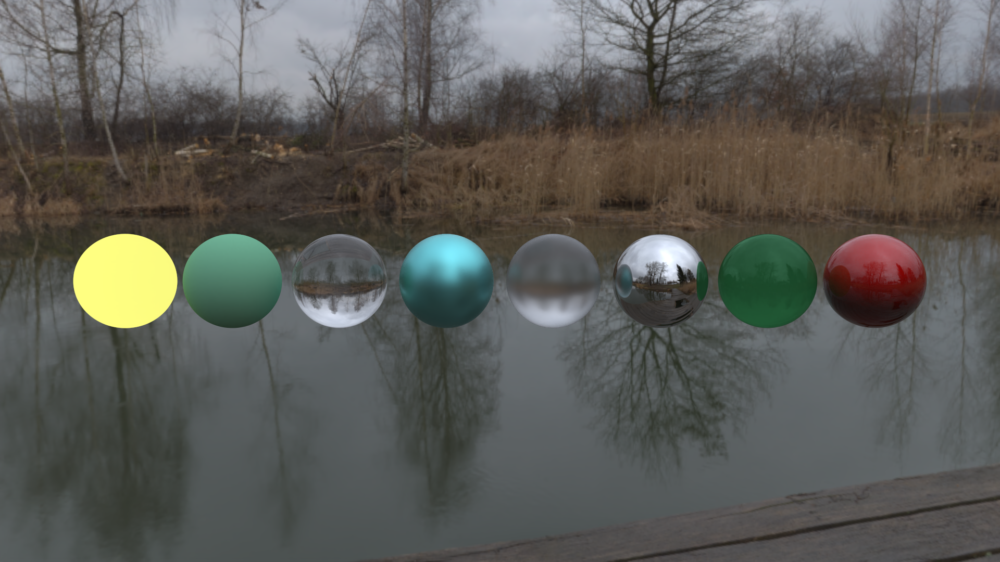
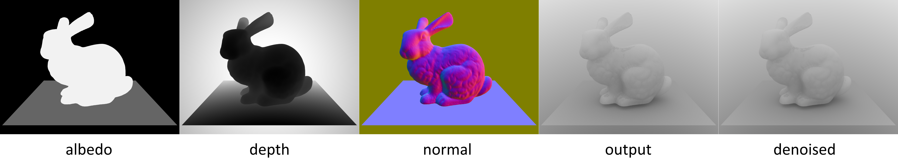
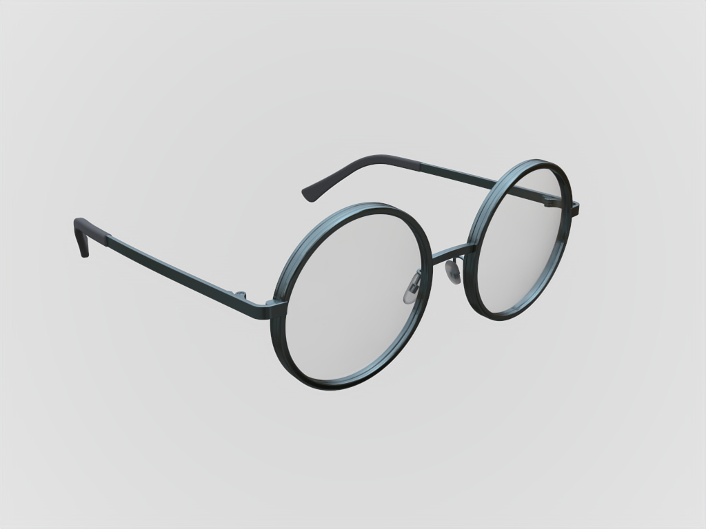

# Atrc

Offline rendering lab based on ray tracing

## Features

- [x] volumetric path tracing
- [x] guided path tracing (ref [here](http://drz.disneyresearch.com/~jnovak/publications/PathGuide/index.html))
- [x] light tracing
- [x] stochastic progressive photon mapping
- [x] Materials: Disney BRDF, frosted glass, mirror, varnish, MTL...
- [x] HDR texture
- [x] (optional) integrated [Embree](https://github.com/embree/embree) engine
- [x] (optional) integrated [BCD](https://github.com/superboubek/bcd) denoiser
- [x] (optional) integrated [OIDN](https://github.com/OpenImageDenoise/oidn) denoiser
- [ ] bidirectional path tracing

## Build

Dependencies:

* cmake (>= 3.10)
* MSVC/clang++ with c++17 support
* (optional) [Intel(R) Open Image Denoise library](https://github.com/OpenImageDenoise/oidn) (required when -DUSE_OIDN=ON)

Other dependencies will be automatically downloaded during building.

```shell
git clone --recursive https://github.com/AirGuanZ/Atrc
cd Atrc
mkdir build
cd build
cmake ..
```

CMake options:

* `-DUSE_EMBREE=ON/OFF` (defaultly set to OFF)
* `-DUSE_BCD=ON/OFF` (defaultly set to OFF)
* `-DUSE_OIDN=ON/OFF` (defaultly set to OFF)
* `-DOIDN_PATH="where OIDN's cmake config is"` (need only when USE_OIDN=ON)

## Gallery

Materials:



Breakfast Room (scene ref [here](http://casual-effects.com/data/index.html)):


G-Buffer & Denoiser (model ref [here](http://graphics.stanford.edu/data/3Dscanrep/)):



Glasses:



Volumetric Rendering (model ref [here](http://casual-effects.com/data/index.html)):

