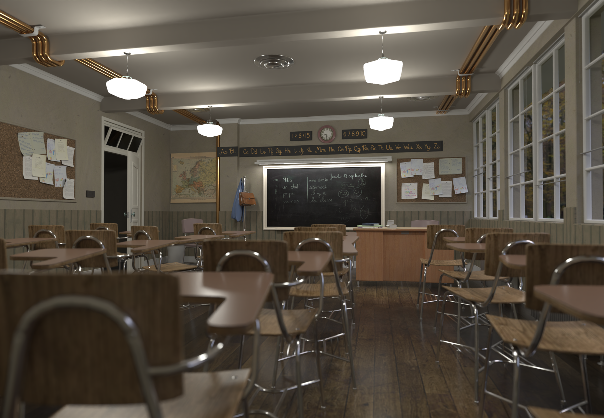
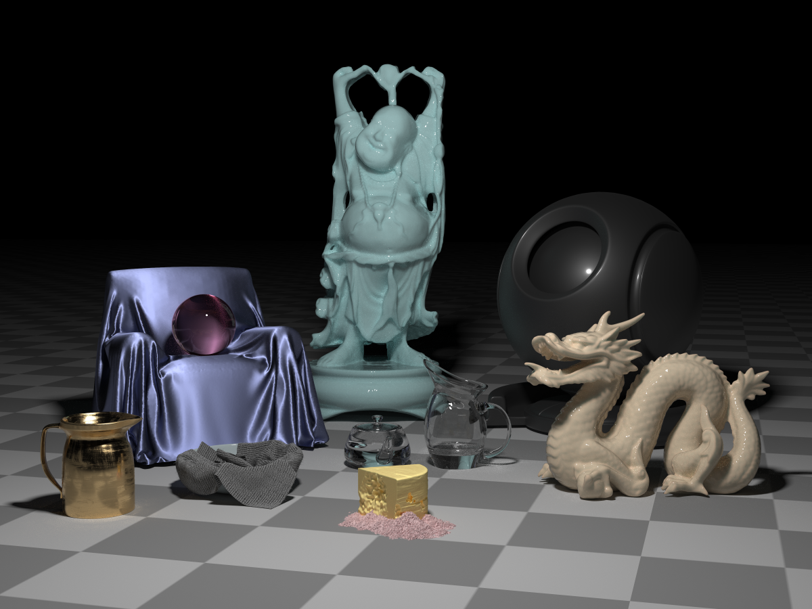
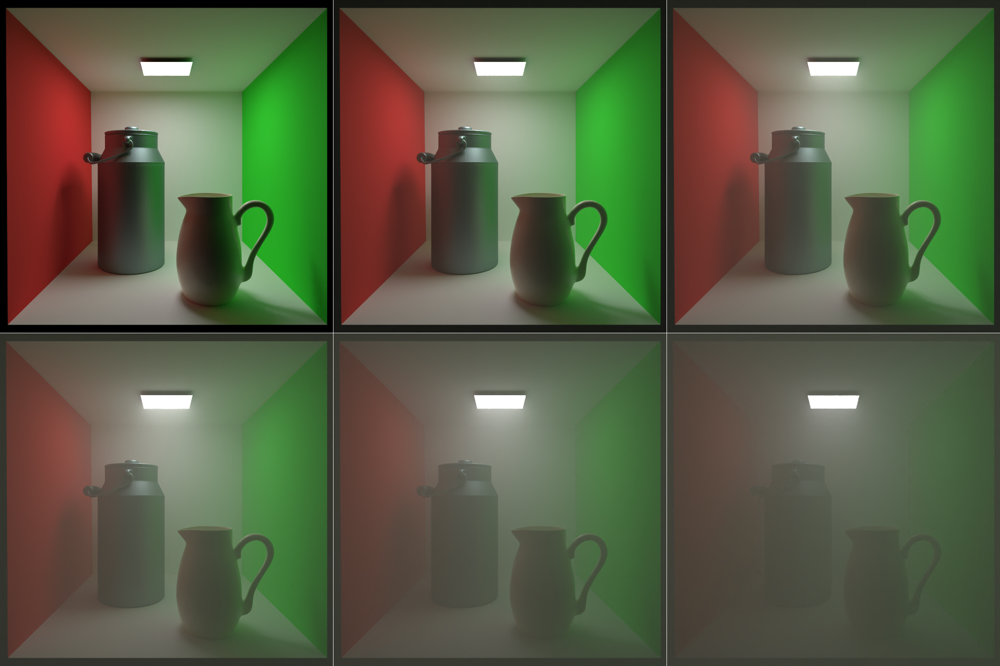
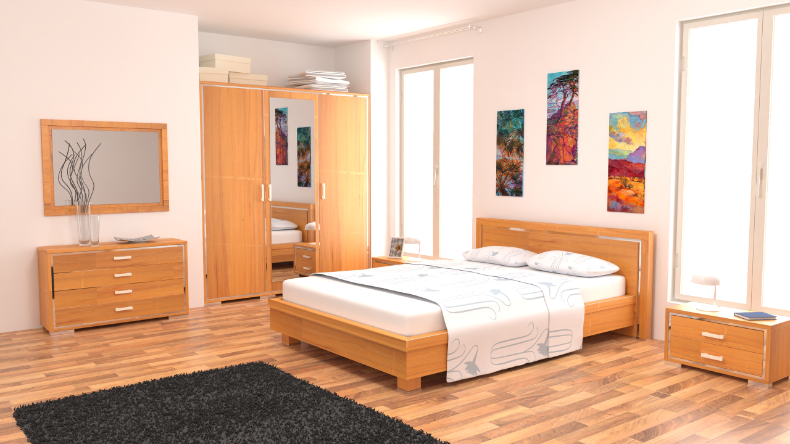
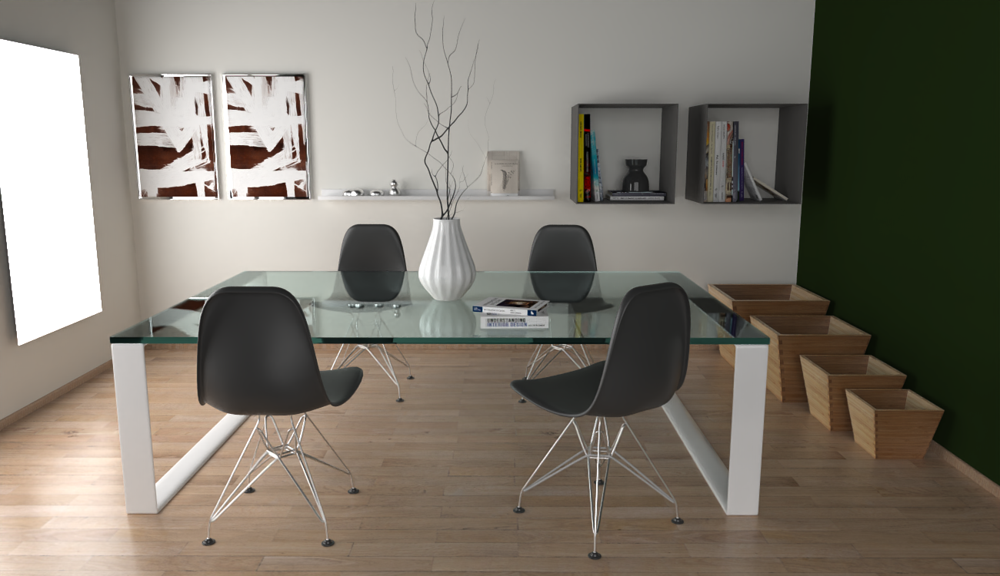

# Atrc

Offline rendering lab based on ray tracing

## Features

- [x] Volumetric path tracing with next event estimation
- [x] Adjoint particle tracing
- [x] Volumetric bidirectional path tracing
- [x] Stochastic progressive photon mapping
- [x] Primary sample space MLT on path tracing
- [x] Various material models: Disney principled BSDF, phong, DreamWorks fabric ...
- [x] Homogeneous/heterogeneous participating medium
- [x] Normalized diffusion BSSRDF
- [x] Almost all material properties can be specified with 2D/3D textures
- [x] Various geometry models: sphere, quad, triangle, disk, mesh
- [x] Two-level accelerating structure (SAH based BVH)
- [x] Importance sampled environment light
- [x] G-buffer output (albedo, normal, ...)
- [x] Depth of field
- [x] ACES tone mapping
- [x] Image sample space low-pass filter
- [x] (Optional) Integrated OIDN library
- [x] (Optional) Integrated Embree library
- [x] Interactive scene editor

## Roadmap

- [x] Component based bsdf
- [x] Volumetric bidirectional path tracing
- [x] Support launching GUI renderer in editor
- [x] Better GUI renderer (auto resizing)
- [x] More sample scenes
- [x] Light sampling hints (user-specified power)
- [ ] Environment light portals
- [ ] Volumetric photon mapping
- [ ] Vertex connection & merging
- [ ] Better camera panel in editor
- [ ] Support BSSRDF in BDPT

## Documentation

[doc](https://airguanz.github.io/atrc_doc/doc.html)

## Gallery

Food (rendered with bdpt) (scene ref [here](https://luxcorerender.org/download/)):

Classroom (rendered with pt) (scene ref [here](https://www.blender.org/download/demo-files/)):

Materials: (rendered with pt):

Fog (rendered with vol_bdpt):

BSSRDF (rendered with pt):

Bedroom (rendered with pt) (scene ref [here](https://benedikt-bitterli.me/resources/)):

Dining Room (rendered with bdpt) (scene ref [here](https://www.blendswap.com/blends/view/86457)):

