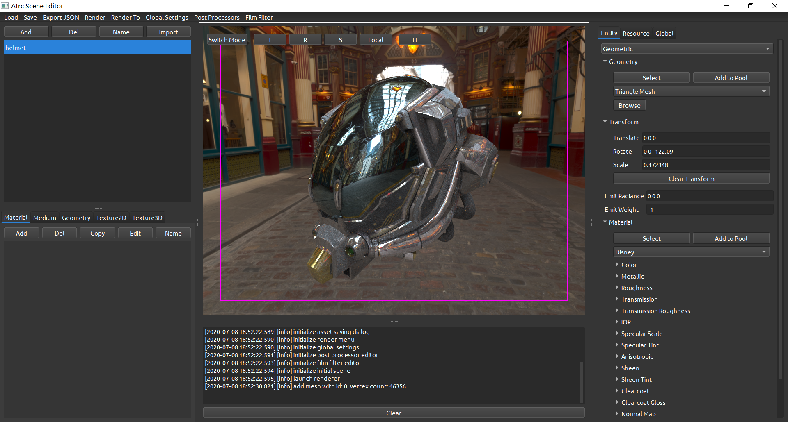
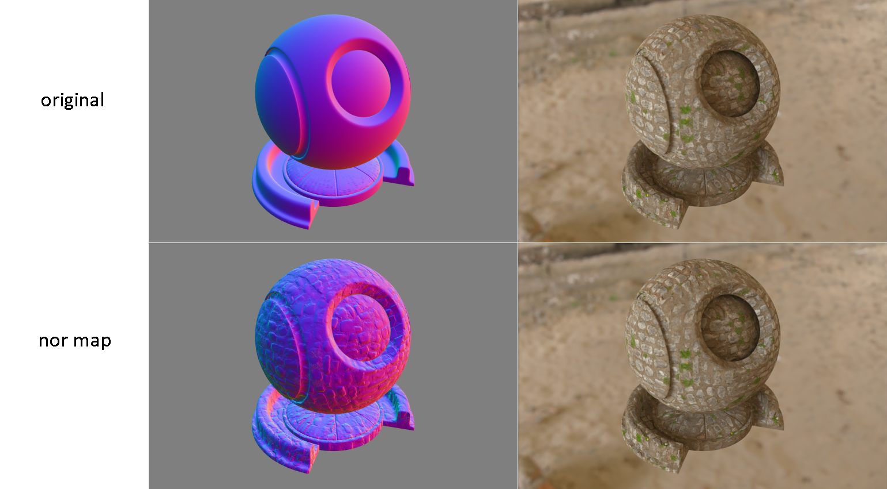
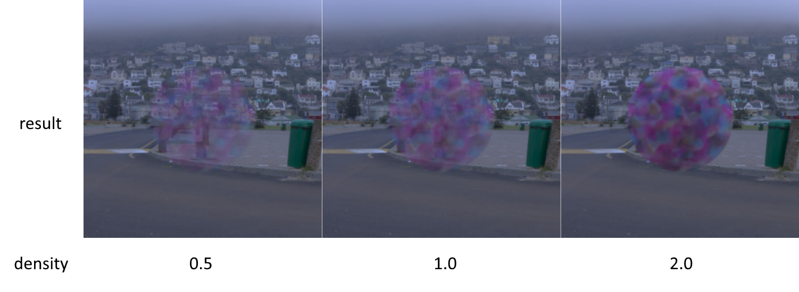
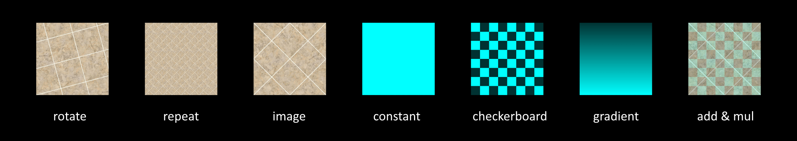

# Atrc Renderer Documentation



[TOC]

## Building

### Dependencies

编译Atrc时须准备的工具如下：

* [cmake](https://cmake.org/) (>=3.10)
* 支持C++17标准主要特性的MSVC或clang++（g++理论上可用，但未经测试）

所有依赖项均已包含在源代码中：

* [agz-utils](https://github.com/AirGuanZ/agz-utils)，提供数学计算、图像加载等基本功能
* [cxxopts](https://github.com/jarro2783/cxxopts)，用于命令行参数解析
* [nlohmann json](https://github.com/nlohmann/json)，用于JSON配置文件的解析
* [stl reader](https://github.com/sreiter/stl_reader)，用于解析STL模型文件
* [tiny obj loader](https://github.com/syoyo/tinyobjloader)，用于解析OBJ模型文件
* [Embree 3.6.1](https://www.embree.org/)，用于加速射线与几何体的求交

需额外准备的依赖项如下：

* [oidn 1.1.0](https://openimagedenoise.github.io/)，基于机器学习的降噪滤波器（仅在启动了`USE_OIDN`选项时需要）
* Qt5 （仅在启用了`BUILD_GUI`或`BUILD_EDITOR`选项时需要）

在Windows下使用MSVC时，将[oidn-1.1.0.x64.vc14.windows.zip](https://github.com/OpenImageDenoise/oidn/releases/download/v1.1.0/oidn-1.1.0.x64.vc14.windows.zip)中的所有文件拷贝到`lib/oidn/vc14`中；使用linux时，将[oidn-1.1.0.x86_64.linux.tar.gz](https://github.com/OpenImageDenoise/oidn/releases/download/v1.1.0/oidn-1.1.0.x86_64.linux.tar.gz)中的所有文件拷贝到`lib/oidn/linux`中。详情可参考`cmake/cmake-oidn`。

### CMake Options

| 选项名       | 默认值 | 含义             |
| ------------ | ------ | ---------------- |
| USE_EMBREE   | OFF    | 启用Embree加速器 |
| USE_OIDN     | OFF    | 启用OIDN降噪器   |
| BUILD_GUI    | OFF    | 启用GUI启动器    |
| BUILD_EDITOR | OFF    | 启用场景编辑器   |

注意到OIDN只支持64位程序，因此若启用了OIDN库，必须以64位模式构建程序。

### Example

以Windows环境为例，若启用Embree、OIDN等可选功能，典型的构建过程如下：

1. 在`PowerShell`中运行命令：

   ```powershell
   git clone --recursive --depth=1 https://github.com/AirGuanZ/Atrc
   ```

4. 在`PowerShell`中继续运行命令：

   ```powershell
   mkdir build
   cd build
   cmake -DUSE_EMBREE=ON -DUSE_OIDN=ON -DBUILD_GUI=ON -DBUILD_EDITOR=ON -DQt5_DIR="../../Qt5" -G "Visual Studio 15 2017 Win64" ..
   ```

这会在`Atrc/build`下生成`Visual Studio 2017`的解决方案文件。

## Usage

### Components

编译Atrc得到的结果由以下几部分构成：

1. CLI，为渲染器的命令行可执行程序，是Tracer的简单应用
2. GUI，为带渲染过程预览的渲染器启动器，是Tracer的简单应用
3. Tracer，基于光线追踪的离线渲染库（静态库）

本节主要介绍CLI的使用，即其命令参数的含义和场景配置文件的编写。

### CLI Usage

在终端中运行命令：

```shell
CLI --help
```

可以查看CLI的命令行参数。典型的使用方法是：

```shell
CLI -d render_config.json
```

其中`scene_config.json`是描述了场景信息和渲染设置的配置文件，其编写方法在之后详细描述。

## Configuration

Atrc使用JSON作为描述场景和渲染设置的配置文件格式。整个JSON文件由两部分构成：

```json
{
    "scene": {
        ...
    },
    "rendering": {
        ...
    }
}
```

其中`scene`为一个类型为`Scene`的场景描述对象（见后文），描述物体、材质、光源等，`rendering`部分描述渲染配置，如摄像机、渲染算法、后处理流程等。


一个简单的配置文件示例如下，它的渲染结果是上图所示的略粗糙的金属球：

```json
{
  "scene": {
    "type": "default",
    "entities": [
      {
        "type": "geometric",
        "geometry": {
          "type": "sphere",
          "radius": 1.6,
          "transform": []
        },
        "material": {
          "type": "disney",
          "base_color": {
            "type": "constant",
            "texel": [ 0.7 ]
          },
          "metallic": {
            "type": "constant",
            "texel": [ 1 ]
          },
          "roughness": {
            "type": "constant",
            "texel": [ 0.15 ]
          }
        }
      }
    ],
    "env": {
      "type": "ibl",
      "tex": {
        "type": "hdr",
        "filename": "${scene-directory}/gray_pier_4k.hdr"
      }
    }
  },
  "rendering": {
    "camera": {
      "type": "thin_lens",
      "pos": [ 0, -5, 1 ],
      "dst": [ 0, 0, 0 ],
      "up": [ 0, 0, 1 ],
      "fov": 64
    },
    "width": 640,
    "height": 640,
    "renderer": {
      "type": "pt",
      "sampler": {
        "type": "native",
        "spp": 100
      }
    },
    "reporter": {
      "type": "stdout"
    },
    "post_processors": [
      {
        "type": "save_to_img",
        "filename": "${scene-directory}/output.png",
        "inv_gamma": 2.2
      }
    ]
  }
}
```

可以看到，Atrc的配置文件由一系列JSON对象嵌套构成，每个字段都有其类型和取值。下面列举一些常见的字段类型的语法（同一字段类型可能有多种写法）：

| 字段类型 | 语法示例                    | 含义                             |
| -------- | --------------------------- | -------------------------------- |
| int      | -1                          | 值为-1的整数                     |
| real     | 1.2                         | 值为1.2的浮点数                  |
| bool     | true                        | 值为真的布尔量；假对应false      |
| string   | "minecraft"                 | 值为"minecraft"的字符串          |
| Spectrum | [ 0.5 ]                     | 值为{ 0.5, 0.5, 0.5 }的RGB三元组 |
| Spectrum | [ 0.1, 0.2, 0.3 ]           | 值为{ 0.1, 0.2, 0.3 }的RGB三元组 |
| Vec2     | [ 2.1 ]                     | 值为{ 2.1, 2.1 }的二维向量       |
| Vec2     | [ 1.2, 2 ]                  | 值为{ 1.2, 2 }的二维向量         |
| Vec3     | [ 2.1 ]                     | 值为{ 2.1, 2.1, 2.1 }的三维向量  |
| Vec3     | [ 1.2, 2.2, 3 ]             | 值为{ 1.2, 2.2, 3 }的三维向量    |
| Vec2i    | [ 1 ]                       | 值为{ 1, 1 }的二维整数向量       |
| Vec2i    | [ -1, 255 ]                 | 值为{ -1, 255 }的二维整数向量    |
| Vec3i    | [ 3 ]                       | 值为{ 3 ,3, 3 }的三维整数向量    |
| Vec3i    | [ 3, -4, 5 ]                | 值为{ 3, -4, 5 }的三维整数向量   |
| [Type]   | [Instance0, Instance1, ...] | 由类型为Type的字段构成的JSON数组 |

当一个字符串表示的是路径或文件名时，其中的`${scene-directory}`表示配置文件所在目录的绝对路径，`${working-directory}`则表示当前可执行程序工作目录的绝对路径。以上面示例配置文件末尾处的`${scene-directory}/output.png`为例，它表示配置文件所处目录下的`output.png`文件。

除了这些类型的字段外，其他类型的字段均以JSON对象的语法出现。这些字段除了具有“类型”这一属性外，还具有“类型值”的属性。譬如，一个类型为“Entity”的字段可以出现在任何一个需要“实体”的地方，而该字段的类型值则由它的属性`type`决定，表示该字段具体是哪一种实体。

在后文的叙述中，我将使用简化的表格形式来表示一个对象应包含哪些字段以及这些字段的含义。以整个配置文件中最后出现的后处理器`save_to_img`为例，它的JSON表示是：

```json
{
	"type": "save_to_img",
	"filename": "${scene-directory}/output.png",
	"inv_gamma": 2.2
}
```

它对应的文档表格为：

| 字段名 | 类型 | 默认值 | 含义 |
| ------ | ---- | ------ | ---- |
| ...    | ...  | ...    | ...  |

表格中，“默认值”一栏为空表示这是一个必须填写的字段，不为空则表示这是一个可选的字段。

### Rendering Settings

本节描述渲染配置文件中的`rendering`一项包含哪些字段。

| 字段名          | 类型             | 默认值            | 含义                       |
| --------------- | ---------------- | ----------------- | -------------------------- |
| camera          | Camera           |                   | 用于观察场景的摄像机       |
| renderer        | Renderer         |                   | 渲染算法                   |
| reporter        | ProgressReporter |                   | 用何种方式输出渲染进度     |
| post_processors | [PostProcessor]  | []                | 图像后处理器，默认为空列表 |
| width           | int              |                   | 图像宽度                   |
| height          | int              |                   | 图像高度                   |
| film_filter     | FilmFilter       | box, radius = 0.5 | 图像重建滤波函数           |

### Scene

本节描述类型为`Scene`的字段有哪些可取的类型值。

**default**

| 字段名    | 类型            | 默认值           | 含义                                         |
| --------- | --------------- | ---------------- | -------------------------------------------- |
| entities  | [Entity]        | []               | 场景中的实体列表，默认为空列表               |
| env       | NonareaLight    | null             | 环境光，默认为空                             |
| aggregate | EntityAggregate | native aggregate | 实体间的空间查询加速数据结构，默认为暴力遍历 |

### EntityAggregate

对于射线和实体间的求交，Atrc使用两级加速数据结构（参考RTX的设计），其中实体内部为一级，实体间为一级。`EntityAggregate`就是实体间加速数据结构对应的字段类型，本节描述它有哪些可取的类型值。

**native**

不包含任何字段。表示暴力遍历所有实体。

**bvh**

用BVH树将实体组织起来。

| 字段名        | 类型 | 默认值 | 含义                         |
| ------------- | ---- | ------ | ---------------------------- |
| max_leaf_size | int  | 5      | 一个叶节点最多包含多少个实体 |

### Camera

本节描述类型为`Camera`的字段有哪些可取的类型值。

**thin_lens**

| 字段名         | 类型 | 默认值 | 含义                                   |
| -------------- | ---- | ------ | -------------------------------------- |
| pos            | Vec3 |        | 观察者位置                             |
| dst            | Vec3 |        | 摄像机看向哪一点，                     |
| up             | Vec3 |        | 用于指定摄像机侧向翻转方向             |
| fov            | real |        | 摄像机竖直方向上的视角大小，单位为角度 |
| lens_radius    | real | 0      | 透镜半径                               |
| focal_distance | real | 1      | 焦平面和镜头的距离                     |

### Entity

本节描述类型为`Entity`的字段有哪些可取的类型值。

所有类型的Entity都具有一个可选的字符串属性：`customed_flag`，该属性的作用在不同的渲染算法下亦不同，如非渲染算法特别指明，通常情况下均可忽略。

**diffuse**


几何漫射光源，即具有几何形状的光源，表面上每一点向所有方向发射相同的辐射亮度，如上图中的球形光源。

| 字段名   | 类型     | 默认值 | 含义     |
| -------- | -------- | ------ | -------- |
| geometry | Geometry |        | 几何形状 |
| radiance | Spectrum |        | 辐射亮度 |
| med_in   | Medium   | void   | 内部介质，默认为真空 |
| med_out  | Medium   | void   | 外部介质，默认为真空 |
| no_denoise | bool | false | 使得降噪器对图像上该物体所在的区域无效 |

**geometric**


普通的物体，可指定其几何形状、材质和内外介质。

| 字段名        | 类型     | 默认值      | 含义                            |
| ------------- | -------- | ----------- | ------------------------------- |
| geometry      | Geometry |             | 几何形状                        |
| material      | Material |             | 实体表面材质                    |
| med_in        | Medium   | void        | 内部介质，默认为真空            |
| med_out       | Medium   | void        | 外部介质，默认为真空            |
| emit_radiance | Spectrum | [ 0, 0, 0 ] | 作为光源的亮度                  |
| no_denoise    | bool     | false       | disable denoiser on this entity |

### FilmFilter

渲染图像的过程也是对图像平面进行采样-重建的过程，`FilmFilter`就是用于重建的滤波函数，详细可参见[此文](http://alvyray.com/Memos/CG/Microsoft/6_pixel.pdf)。若对这部分内容不甚了解，推荐使用最简单的重建滤波函数：

```json
"type": "box",
"radius": 0.5
```

**box**

最简单的正方形滤波函数，半径取为0.5时恰好和单个像素重合。

| 字段名 | 类型 | 默认值 | 含义                         |
| ------ | ---- | ------ | ---------------------------- |
| radius | real |        | 滤波函数非零半径，单位为像素 |

**gaussian**

Gaussian滤波函数。

| 字段名 | 类型 | 默认值 | 含义                         |
| ------ | ---- | ------ | ---------------------------- |
| radius | real |        | 滤波函数非零半径，单位为像素 |
| alpha  | real |        | gaussian函数参数$\alpha$     |

### Geometry

用于描述物体的几何形状。

绝大部分几何形状都包含类型为`[Transform]`的`transform`字段，即一系列`Transform`的序列。值得注意的是，序列中后面的`Transform`先作用到物体上，前面的`Transform`后作用到物体上。

**disk**


单面圆盘。

| 字段名    | 类型        | 默认值 | 含义                                 |
| --------- | ----------- | ------ | ------------------------------------ |
| transform | [Transform] |        | 从本地坐标系到世界坐标系中的变换序列 |
| radius    | real        |        | 圆盘半径                             |

**double_sided**

双面适配器，它将一个单面几何形状转为双面，主要适用于圆盘、三角形等面片形式的几何形状。

| 字段名   | 类型     | 默认值 | 含义                     |
| -------- | -------- | ------ | ------------------------ |
| internal | Geometry |        | 被从单面转为双面的几何体 |

**quad**


单面四边形$ABCD$，由两个三角形$ABC$和$ACD$构成。

| 字段名    | 类型        | 默认值 | 含义                                 |
| --------- | ----------- | ------ | ------------------------------------ |
| transform | [Transform] |        | 从本地坐标系到世界坐标系中的变换序列 |
| A         | Vec3        |        | 顶点A的坐标                          |
| B         | Vec3        |        | 顶点B的坐标                          |
| C         | Vec3        |        | 顶点C的坐标                          |
| D         | Vec3        |        | 顶点D的坐标                          |
| tA        | Vec2        | (0, 0) | 顶点A的纹理坐标                      |
| tB        | Vec2        | (0, 0) | 顶点B的纹理坐标                      |
| tC        | Vec2        | (0, 0) | 顶点C的纹理坐标                      |
| tD        | Vec2        | (0, 0) | 顶点D的纹理坐标                      |

**sphere**


单面球体，面向外侧。

| 字段名    | 类型        | 默认值 | 含义                                 |
| --------- | ----------- | ------ | ------------------------------------ |
| transform | [Transform] |        | 从本地坐标系到世界坐标系中的变换序列 |
| radius    | real        |        | 球体半径                             |

**triangle**


单面三角形。

| 字段名    | 类型        | 默认值 | 含义                                 |
| --------- | ----------- | ------ | ------------------------------------ |
| transform | [Transform] |        | 从本地坐标系到世界坐标系中的变换序列 |
| A         | Vec3        |        | 顶点A的坐标                          |
| B         | Vec3        |        | 顶点B的坐标                          |
| C         | Vec3        |        | 顶点C的坐标                          |
| tA        | Vec2        | (0, 0) | 顶点A的纹理坐标                      |
| tB        | Vec2        | (0, 0) | 顶点B的纹理坐标                      |
| tC        | Vec2        | (0, 0) | 顶点C的纹理坐标                      |

**triangle_bvh**


以BVH树组织而成的三角形网格形状，在启用了Embree时使用Embree实现，否则使用自行构建的BVH树。

| 字段名    | 类型        | 默认值 | 含义                                 |
| --------- | ----------- | ------ | ------------------------------------ |
| transform | [Transform] |        | 从本地坐标系到世界坐标系中的变换序列 |
| filename  | string      |        | 模型文件路径，支持OBJ文件和STL文件   |

**triangle_bvh_embree**

使用Embree实现的三角形网格形状，参数和`triangle_bvh`相同。

**triangle_bvh_noembree**

不使用Embree实现的三角形网格形状，参数和`triangle_bvh`相同。

### Material

材质描述了物体表面与光的交互过程，本节介绍类型为`Material`的字段可取的类型值。

**Normal Mapping**



部分材质支持法线映射（normal mapping），这些材质的参数列表中会包含一项`normal_map`。

**disney_reflection (deprecated)**

Disney Principled BRDF的完整实现，有的参数含义我不知道怎么翻译比较合适，所以最好参考[原文](https://disney-animation.s3.amazonaws.com/library/s2012_pbs_disney_brdf_notes_v2.pdf)。

| 字段名          | 类型      | 默认值          | 含义                                       |
| --------------- | --------- | --------------- | ------------------------------------------ |
| base_color      | Texture2D |                 | 基本颜色                                   |
| metallic        | Texture2D |                 | 金属度                                     |
| roughness       | Texture2D |                 | 粗糙度                                     |
| subsurface      | Texture2D | all_zero        | 次表面散射度，注意这并不是BSSRDF，只是近似 |
| specular        | Texture2D | all_zero        | 高光度                                     |
| specular_tint   | Texture2D | all_zero        | 高光颜色一致性                             |
| anisotropic     | Texture2D | all_zero        | 各向异性度                                 |
| sheen           | Texture2D | all_zero        | 边缘光泽度                                 |
| sheen_tint      | Texture2D | all_zero        | 边缘光泽颜色一致性                         |
| clearcoat       | Texture2D | all_zero        | 清漆强度                                   |
| clearcoat_gloss | Texture2D | all_one         | 清漆光泽度                                 |
| normal_map      | Texture2D | all_{ 0, 0, 1 } | 法线贴图                                   |

*NOTE*：`disney_reflection`对材质的表现范围基本是`disney`的子集，故建议使用后者。

**disney**


Disney Principled BSDF，具体可参考[原文](https://blog.selfshadow.com/publications/s2015-shading-course/#course_content)。

| 字段名                 | 类型      | 默认值          | 含义                                        |
| ---------------------- | --------- | --------------- | ------------------------------------------- |
| base_color             | Texture2D |                 | 基本颜色，取值范围为$[0, 1]^3$              |
| metallic               | Texture2D |                 | 金属度，取值范围为$[0,1]$                   |
| roughness              | Texture2D |                 | 粗糙度，取值范围为$[0,1]$                   |
| specular_scale         | Texture2D | all_one         | 非金属高光颜色缩放因子，取值范围为$[0,1]^3$ |
| specular_tint          | Texture2D | all_zero        | 高光颜色一致性，取值范围为$[0,1]$           |
| anisotropic            | Texture2D | all_zero        | 各向异性度，取值范围为$[0,1]$               |
| sheen                  | Texture2D | all_zero        | 边缘光泽度，取值范围为$[0,1]$               |
| sheen_tint             | Texture2D | all_zero        | 边缘光泽颜色一致性，取值范围为$[0,1]$       |
| clearcoat              | Texture2D | all_zero        | 清漆强度，取值范围为$[0,1]$                 |
| clearcoat_gloss        | Texture2D | all_one         | 清漆光泽度，取值范围为$[0,1]$               |
| transmission           | Texture2D | all_zero        | 透明度，取值范围为$[0,1]$                   |
| transmission_roughness | Texture2D | roughness       | 折射粗糙度，取值范围为$[0, 1]$              |
| ior                    | Texture2D | all_{1.5}       | 内外折射率之比，取值范围为$[0,\infty)$      |
| normal_map             | Texture2D | all_{ 0, 0, 1 } | 法线贴图                                    |

**frosted_glass**


磨砂玻璃材质，详情请参考[Microfacet Models for Refraction through Rough Surfaces](https://www.cs.cornell.edu/~srm/publications/EGSR07-btdf.html)。

| 字段名    | 类型      | 默认值 | 含义           |
| --------- | --------- | ------ | -------------- |
| color_map | Texture2D |        | 表面颜色       |
| ior       | Texture2D |        | 内外折射率之比 |
| roughness | Texture2D |        | 粗糙度         |

**glass**


光滑玻璃材质。

| 字段名               | 类型      | 默认值 | 含义              |
| -------------------- | --------- | ------ | ----------------- |
| color_map            | Texture2D |        | 表面颜色          |
| color_reflection_map | Texture2D |        | 反射颜色          |
| color_refraction_map | Texture2D |        | 折射颜色          |
| eta                  | Texture2D |        | 内外折射率之比    |
| k                    | Texture2D |        | 吸收率/外部折射率 |

提供两种颜色指定方式：

1. 只提供`color_map`，此时反射和折射的颜色都由`color_map`给出
2. 提供`color_reflection_map`和`color_refraction_map`，它们分别给出了反射颜色和折射颜色

**ideal_black**

完全吸收材质，也就是一团黑。

**ideal_diffuse**


理想漫反射，反射到各方向的辐射亮度均相同。

| 字段名     | 类型      | 默认值          | 含义     |
| ---------- | --------- | --------------- | -------- |
| albedo     | Texture2D |                 | 表面颜色 |
| normal_map | Texture2D | all_{ 0, 0, 1 } | 法线贴图 |

**mirror**


理想镜面。

| 字段名  | 类型    | 默认值 | 含义      |
| ------- | ------- | ------ | --------- |
| color_map  | Texture2D |        | 表面颜色  |
| ior | Texture2D |        | 内外折射率之比 |

**mtl**

由Wavefront MTL文件描述的材质，也就是标准的漫反射+高光。

| 字段名 | 类型      | 默认值 | 含义       |
| ------ | --------- | ------ | ---------- |
| kd     | Texture2D |        | 漫反射强度 |
| ks     | Fresnel   |        | 高光强度   |
| ns     | Texture2D |        | 高光光泽度 |

**add**


把多个材质直接叠加到一起。上图中的第三幅是使用`add`和`scale`配合，将前两幅图像中的物体材质按$1/2$的权重求和得到的效果。

| 字段名 | 类型       | 默认值 | 含义             |
| ------ | ---------- | ------ | ---------------- |
| mats   | [Material] |        | 被叠加的材质数组 |

**scale**

线性地缩放一个材质的反射/折射亮度。

| 字段名   | 类型      | 默认值 | 含义         |
| -------- | --------- | ------ | ------------ |
| internal | Material  |        | 被缩放的材质 |
| scale    | Texture2D |        | 缩放比       |

**mirror_varnish**


表面绝对光滑的清漆，其内部必须是不透明材质。

| 字段名   | 类型      | 默认值  | 含义             |
| -------- | --------- | ------- | ---------------- |
| internal | Material  |         | 清漆内部的材质   |
| eta_in   | Texture2D |         | 清漆内部的折射率 |
| eta_out  | Texture2D | all_one | 清漆外部的折射率 |
| color    | Texture2D |         | 清漆颜色         |

**phong**

光照模型：
$$
\begin{aligned}f_r(\omega_i, x, \omega_o) &= \frac d {\pi} + \frac{sD}{4\cos\langle\omega_i, n_x\rangle\cos\langle \omega_o, n_x\rangle} \\D &= \frac{e + 1}{2\pi}\cos^e\langle\omega_h, n_x\rangle \\\omega_h &= \mathrm{normalize}(\mathrm{normalize}(\omega_i) + \mathrm{normalize}(\omega_o))\end{aligned}
$$
其中，$\omega_i$是入射方向，$\omega_o$是出射方向，$x$是反射点，$d$是漫反射强度，$s$是高光强度，$e$是高光光滑度，$n_x$是$x$点的法向量。

*NOTE*. Atrc会自动对$d$和$s$进行等比例缩放，以确保反射能量不会超过入射能量。

| 字段名 | 类型      | 默认值 | 含义       |
| ------ | --------- | ------ | ---------- |
| d      | Texture2D |        | 漫反射颜色 |
| s      | Texture2D |        | 高光颜色   |
| ns     | Texture2D |        | 高光光泽度 |

**invisible_surface**

完全隐形的材质，主要用于包裹一些特殊的内部介质，如烟雾等

### Medium

物体内部介质的描述。

**void**

真空，也就是什么介质也没有。

**absorb**

无散射的介质。

| 字段名  | 类型     | 默认值 | 含义   |
| ------- | -------- | ------ | ------ |
| sigma_a | Spectrum |        | 吸收率 |

**heterogeneous**



基于三维纹理定义的非均匀介质

| 字段名               | 类型        | 默认值  | 含义                                         |
| -------------------- | ----------- | ------- | -------------------------------------------- |
| transform            | [Transform] |         | 从$[0, 1]^3$的纹理参数空间到世界空间的变换   |
| density              | Texture3D   |         | 介质密度，即$\sigma_s + \sigma_a$            |
| albedo               | Texture3D   |         | 反照率，即$\sigma_s / (\sigma_s + \sigma_a)$ |
| g                    | Texture3D   |         | 散射方向的不对称度                           |
| max_scattering_count | int         | INT_MAX | 最大连续散射次数                             |

**homogeneous**


各处散射性质均相同的介质。

| 字段名               | 类型     | 默认值  | 含义               |
| -------------------- | -------- | ------- | ------------------ |
| sigma_a              | Spectrum |         | 吸收率             |
| sigma_s              | Spectrum |         | 散射率             |
| g                    | real     |         | 散射方向的不对称度 |
| max_scattering_count | int      | INT_MAX | 最大连续散射次数   |

### NonareaLight

本节描述类型为`NonareaLight`的字段有哪些可取的类型值。

**ibl**


环境光的一种，由纹理给出它在每个方向上的辐射亮度，映射方式这里就不再赘述了。

| 字段名 | 类型      | 默认值 | 含义                   |
| ------ | --------- | ------ | ---------------------- |
| tex    | Texture2D |        | 描述辐射亮度的纹理对象 |

**native_sky**


环境光的一种，表示自上而下颜色渐变的天空。

| 字段名 | 类型     | 默认值 | 含义             |
| ------ | -------- | ------ | ---------------- |
| top    | Spectrum |        | 最上方的辐射亮度 |
| bottom | Spectrum |        | 最下方的辐射亮度 |

### Post Processor

在渲染完成后用于图像处理的后处理器。

**flip**

翻转图像。

| 字段名       | 类型 | 默认值 | 含义                     |
| ------------ | ---- | ------ | ------------------------ |
| vertically   | bool | false  | 是否在垂直方向上翻转图像 |
| horizontally | bool | false  | 是否在水平方向上翻转图像 |

**gamma**

对图像进行gamma校正。

| 字段名    | 类型 | 默认值 | 含义         |
| --------- | ---- | ------ | ------------ |
| gamma     | real |        | $\gamma$值   |
| inv_gamma | real |        | $1/\gamma$值 |

`gamma`和`inv_gamma`只需给出其中一个即可。

**oidn_denoiser**

使用OIDN对图像进行降噪，注意最好使用支持G-Buffer的`Flim`和`Renderer`。

| 字段名 | 类型 | 默认值 | 含义                              |
| ------ | ---- | ------ | --------------------------------- |
| clamp  | bool | false  | 降噪前是否将图像颜色clamp至[0, 1] |

**save_gbuffer_to_png**


将G-Buffer保存至png文件。

| 字段名 | 类型   | 默认值 | 含义                 |
| ------ | ------ | ------ | -------------------- |
| albedo | string | ""     | 将材质颜色保持至何处 |
| normal | string | ""     | 将法线保存至何处     |

**save_to_img**

将图像保存至文件。

| 字段名    | 类型   | 默认值        | 含义                                        |
| --------- | ------ | ------------- | ------------------------------------------- |
| filename  | string |               | 将图像保存至何处                            |
| open      | bool   | false         | 保存完成后是否使用默认图像浏览器打开它      |
| gamma     | real   | 1             | 保存前进行gamma校正时使用的$\gamma$值       |
| inv_gamma | real   | 1             | 保存前进行gamma校正时使用的$1/\gamma$值     |
| ext       | string | from filename | 保存文件类型，取值范围为"png"，"jpg"或"hdr" |

`gamma`和`inv_gamma`只需给出其中一个即可，若都未指定，则不进行gamma校正。

**resize**

将图像和G-Buffer缩放至指定大小。

| 字段名 | 类型       | 默认值 | 含义           |
| ------ | ---------- | ------ | -------------- |
| size   | [int, int] |        | 目标图像的大小 |

### Renderer

渲染算法。

**pt**

最传统的路径追踪，可以通过`integrator`来指定使用怎样的追踪策略。

| 字段名         | 类型                  | 默认值 | 含义                         |
| -------------- | --------------------- | ------ | ---------------------------- |
| integrator     | PathTracingIntegrator |        | 路径追踪策略                 |
| task_grid_size | int                   | 32     | 渲染子任务的规模，单位为像素 |
| worker_count   | int                   | 0      | 工作线程数                   |
| sampler        | Sampler               |        | 随机数采样器                 |
| min_depth      | int                   | 5      | 使用RR策略前的最小路径深度   |
| max_depth      | int                   | 10     | 路径的最大截断深度           |
| cont_prob      | real                  | 0.9    | 追踪时使用RR策略的通过概率   |
| use_mis        | bool                  | true   | 是否使用MIS技术计算直接光照  |

整幅图像被划分为多个正方形的像素块，每个像素块作为一个子任务被分配给某个工作线程执行。

当工作线程数$n \le 0$时，设硬件线程数为$k$，则将使用$\max\{1, k+n\}$个工作线程。比如可以将`worker_count`设置为-2，表示留两个硬件线程，把其他硬件线程都用起来。

**ao**


环境光遮蔽渲染器

| 字段名                 | 类型     | 默认值 | 含义                         |
| ---------------------- | -------- | ------ | ---------------------------- |
| worker_count           | int      | 0      | 工作线程数                   |
| task_grid_size         | int      | 32     | 渲染子任务的规模，单位为像素 |
| ao_sample_count        | int      | 5      | 每条camera ray对应多少ao采样 |
| low_color              | Spectrum | [ 0 ]  | 被完全遮蔽处的颜色           |
| high_color             | Spectrum | [ 1 ]  | 无任何遮蔽处的颜色           |
| max_occlusion_distance | real     | 1      | 最大遮蔽距离                 |
| background_color       | Spectrum | [ 0 ]  | 背景色                       |
| sampler                | Sampler  |        | 采样器                       |

**bdpt**

双向路径追踪渲染器

| 字段名           | 类型    | 默认值 | 含义                         |
| ---------------- | ------- | ------ | ---------------------------- |
| worker_count     | int     | 0      | 工作线程数                   |
| task_grid_size   | int     | 32     | 渲染子任务的规模，单位为像素 |
| camera_max_depth | int     | 10     | 摄像机子路径最大长度         |
| light_max_depth  | int     | 10     | 光源子路径最大长度           |
| use_mis          | bool    | true   | 是否使用多重重要性采样       |
| sampler          | Sampler |        | 采样器                       |

**particle**

粒子追踪器，从光源出发建立从光源到摄像机的路径，收敛十分缓慢。

| 字段名                 | 类型    | 默认值 | 含义                                       |
| ---------------------- | ------- | ------ | ------------------------------------------ |
| worker_count           | int     | 0      | 工作线程数                                 |
| particle_task_count    | int     |        | 粒子追踪任务数                             |
| backward_sampler       | Sampler |        | 粒子追踪采样器                             |
| min_depth              | int     | 5      | 使用RR策略前的最小路径深度                 |
| max_depth              | int     | 10     | 路径的最大截断深度                         |
| cont_prob              | real    | 0.9    | 追踪时使用RR策略的通过概率                 |
| forward_task_grid_size | int     | 32     | forward pass中渲染子任务的规模，单位为像素 |
| forward_sampler        | Sampler |        | forward pass所使用的采样器                 |

`particle`用从光源出发的策略构建光线传输路径，称为backward pass；而对长度为1的路径（即从摄像机直接看到光源），`particle`进行了特殊处理——这些路径是从摄像机出发构建的，称为forward pass。两个pass相对独立。

Backward pass由`particle_task_count`个粒子追踪任务构成，每个任务包含的粒子数为`backward_sampler`的`spp`，故总共追踪了`particle_task_count * backward_sampler.spp`条路径。

### ProgressReporter

用于输出渲染进度。

**stdout**

输出到标准输出流。

**noout**

无任何进度输出。

### Sampler

随机数采样器。

**native**

最基本的随机数采样器，所有样本间都是独立的。

| 字段名 | 类型 | 默认值  | 含义                                               |
| ------ | ---- | ------- | -------------------------------------------------- |
| seed   | int  | by time | 种子值，默认使用时间作为种子                       |
| spp    | int  |         | 每像素采样数，注意这一设置对一些特定的Renderer无效 |

**sobol**

基于Sobol序列的采样器。

| 字段名 | 类型 | 默认值  | 含义                                               |
| ------ | ---- | ------- | -------------------------------------------------- |
| seed   | int  | by time | 种子值，默认使用时间作为种子                       |
| spp    | int  |         | 每像素采样数，注意这一设置对一些特定的Renderer无效 |

`seed`用于构造一个rng，此rng对每个像素中的sobol采样点施加随机偏移。

### Texture2D



所有二维纹理都包含以下字段（这些字段不在后面的每种纹理中列出）：

| 字段名    | 类型         | 默认值  | 含义                                                         |
| --------- | ------------ | ------- | ------------------------------------------------------------ |
| inv_v     | bool         | false   | 将v坐标变换为1-v                                             |
| inv_u     | bool         | false   | 将u坐标变换为1-u                                             |
| swap_uv   | bool         | false   | 交换uv坐标                                                   |
| transform | [Transform2] | []      | 对uv坐标实施的仿射变换序列                                   |
| wrap_u    | string       | "clamp" | 对超出$[0, 1]$范围的u坐标的处理方法，有"clamp/repeat/mirror"三种取值 |
| wrap_v    | string       | "clamp" | 对超出$[0, 1]$范围的u坐标的处理方法，有"clamp/repeat/mirror"三种取值 |
| inv_gamma | real         | 1       | 用于对纹理做gamma逆校正，典型值为2.2                         |

注意到`inv_v, inv_u, swap_uv`和`transform`都是对uv的变换，其中`transform`最先起作用，随后`swap_uv`起作用，`inv_u`和`inv_v`最后起作用。在`transform`序列中，写在前面的变换后起作用，写在后面的变换先起作用。

**checker_board**

棋盘网格纹理，主要用于测试uv

| 字段名     | 类型     | 默认值 | 含义                       |
| ---------- | -------- | ------ | -------------------------- |
| grid_count | real     |        | 棋盘上一条边上被分了多少格 |
| color1     | Spectrum | [ 0 ]  | 一种格子的颜色             |
| color2     | Spectrum | [ 1 ]  | 另一种各自的颜色           |

**constant**

常值纹理，即在它的任何部位采样都会获得相同值

| 字段名 | 类型     | 默认值 | 含义   |
| ------ | -------- | ------ | ------ |
| texel  | Spectrum |        | 纹素值 |

**hdr**

从.hdr文件中加载出的纹理

| 字段名   | 类型   | 默认值   | 含义                                |
| -------- | ------ | -------- | ----------------------------------- |
| filename | string |          | hdr文件路径                         |
| sample   | string | "linear" | 采样策略，取值为"linear"或"nearest" |

**image**

从各种常见图像文件格式（.bmp，.jpg，.png，.tga等）中加载出的纹理

| 字段名   | 类型   | 默认值   | 含义                                |
| -------- | ------ | -------- | ----------------------------------- |
| filename | string |          | 图像文件路径                        |
| sample   | string | "linear" | 采样策略，取值为"linear"或"nearest" |

**scale**

对另一纹理对象进行线性放缩的wrapper

| 字段名   | 类型      | 默认值 | 含义         |
| -------- | --------- | ------ | ------------ |
| scale    | Spectrum  |        | 放缩比值     |
| internal | Texture2D |        | 被放缩的纹理 |

**gradient**

线性渐变纹理，沿`u`方向渐变，可通过纹理坐标变换实现其他方向的渐变

| 字段名 | 类型     | 默认值 | 含义            |
| ------ | -------- | ------ | --------------- |
| color1 | Spectrum |        | `u=0`一侧的颜色 |
| color2 | Spectrum |        | `u=1`一侧的颜色 |

**add**

用于将另外两个纹理加到一起

| 字段名 | 类型      | 默认值 | 含义   |
| ------ | --------- | ------ | ------ |
| lhs    | Texture2D |        | 左加数 |
| rhs    | Texture2D |        | 右加数 |

**mul**

用于将另外两个纹理乘到一起

| 字段名 | 类型      | 默认值 | 含义   |
| ------ | --------- | ------ | ------ |
| lhs    | Texture2D |        | 左乘数 |
| rhs    | Texture2D |        | 右乘数 |

**lum_classify**

用一幅纹理在另两幅纹理间进行选择

| 字段名    | 类型      | 默认值 | 含义               |
| --------- | --------- | ------ | ------------------ |
| internal  | Texture2D |        | 用来选择的纹理     |
| threshold | Texture2D |        | 表示选择阈值的纹理 |
| high      | Texture2D |        | 被选择的一幅纹理   |
| low       | Texture2D |        | 被选择的另一幅纹理 |

对纹理$T$，用$T(u, v)$表示以纹理坐标$(u, v)$对$T$采样得到的结果，则`lum_classify`定义为：

$$
\mathrm{lum\_classify}(u, v) := \begin{cases}\begin{aligned}
    &\mathrm{high}(u,v), &\mathrm{internal}(u, v) \ge \mathrm{threshold}(u, v) \\
    &\mathrm{low}(u, v), &\text{otherwise}
\end{aligned}\end{cases}
$$

**reverse**

反转一幅纹理的颜色

| 字段名   | 类型      | 默认值 | 含义         |
| -------- | --------- | ------ | ------------ |
| internal | Texture2D |        | 被反转的纹理 |

$$
\mathrm{reverse}(u, v) := \mathrm{clamp}(1 - \mathrm{internal}(u, v), 0, 1)
$$

### Texture3D

所有三维纹理都包含以下字段（这些字段不在后面的每种纹理中列出）：

| 字段名    | 类型         | 默认值      | 含义                                                       |
| --------- | ------------ | ----------- | ---------------------------------------------------------- |
| inv_v     | bool         | false       | 将v坐标变换为1-v                                           |
| inv_u     | bool         | false       | 将u坐标变换为1-u                                           |
| inv_w     | bool         | false       | 将w坐标变换为1-w                                           |
| uvw_perm  | Vec3i        | [ 0, 1, 2 ] | 对uvw三个坐标的置换                                        |
| transform | [Transform2] | []          | 对uvw坐标实施的仿射变换序列                                |
| wrap_u    | string       | "clamp"     | 对超出$[0, 1]$的u坐标的处理方法，有clamp/repeat/mirror三种 |
| wrap_v    | string       | "clamp"     | 对超出$[0, 1]$的v坐标的处理方法，有clamp/repeat/mirror三种 |
| wrap_w    | string       | "clamp"     | 对超出$[0, 1]$的w坐标的处理方法，有clamp/repeat/mirror三种 |
| inv_gamma | real         | 1           | 用于对纹理做gamma逆校正，典型值为2.2                       |

注意到`inv_v, inv_u, inv_w, uvw_perm`和`transform`都是对uvw的变换，其中`transform`最先起作用，随后`uvw_perm`起作用，`inv_u, inv_v`和`inv_w`最后起作用。在`transform`序列中，写在前面的变换后起作用，写在后面的变换先起作用。

**constant**

常值纹理，即在它的任何部位采样都会获得相同值

| 字段名 | 类型     | 默认值 | 含义   |
| ------ | -------- | ------ | ------ |
| texel  | Spectrum |        | 纹素值 |

**gray_grid**

单色网格点阵，通过三线性插值得到格点间的值

| 字段名          | 类型     | 默认值 | 含义                     |
| --------------- | -------- | ------ | ------------------------ |
| ascii_filename  | string   |        | 文本格式体素数据的文件名 |
| binary_filename | string   |        | 二进制体素数据的文件名   |
| image_filenames | [string] |        | 图像切片的文件名数组     |

可以通过三种方式向`gray_grid`提供体素数据，因此只需填写上表中三个字段中的一个即可。

文本体素数据的格式为：

```
int32 value (纹理宽度)
int32 value (纹理高度)
int32 value (纹理深度)
for z in 0 to 深度
    for y in 0 to 高度
        for x in 0 to 宽度
            float value ({ x, y, z }处的体素值)
```

二进制体素数据的数据排布与文本格式相似，只不过所有数据都以小端序存储为二进制数据。

图像切片的文件名数组是指将体素在深度方向上拆解，得到的一系列二维图像的文件名。这些二维图像的大小必须相同，其数量对应了纹理的深度值。

**spectrum_grid**

单色网格点阵，通过三线性插值得到格点间的值

| 字段名          | 类型     | 默认值 | 含义                     |
| --------------- | -------- | ------ | ------------------------ |
| ascii_filename  | string   |        | 文本格式体素数据的文件名 |
| binary_filename | string   |        | 二进制体素数据的文件名   |
| image_filenames | [string] |        | 图像切片的文件名数组     |

可以通过三种方式向`spectrum_grid`提供体素数据，因此只需填写上表中三个字段中的一个即可。

文本体素数据的格式为：

```
int32 value (纹理宽度)
int32 value (纹理高度)
int32 value (纹理深度)
for z in 0 to 深度
    for y in 0 to 高度
        for x in 0 to 宽度
            float value ({ x, y, z }处的r值)
            float value ({ x, y, z }处的g值)
            float value ({ x, y, z }处的b值)
```

二进制体素数据的数据排布与文本格式相似，只不过所有数据都以小端序存储为二进制数据。

图像切片的文件名数组是指将体素在深度方向上拆解，得到的一系列二维图像的文件名。这些二维图像的大小必须相同，其数量对应了纹理的深度值。

**add**

用于将另外两个纹理加到一起

| 字段名 | 类型      | 默认值 | 含义   |
| ------ | --------- | ------ | ------ |
| lhs    | Texture3D |        | 左加数 |
| rhs    | Texture3D |        | 右加数 |

**mul**

用于将另外两个纹理乘到一起

| 字段名 | 类型      | 默认值 | 含义   |
| ------ | --------- | ------ | ------ |
| lhs    | Texture3D |        | 左乘数 |
| rhs    | Texture3D |        | 右乘数 |

**scale**

对另一纹理对象进行线性放缩的wrapper

| 字段名   | 类型      | 默认值 | 含义         |
| -------- | --------- | ------ | ------------ |
| scale    | Spectrum  |        | 放缩比值     |
| internal | Texture3D |        | 被放缩的纹理 |

**lum_classify**

用两幅纹理做比较 ，基于比较结果在另两幅纹理间进行选择

| 字段名        | 类型      | 默认值 | 含义               |
| ------------- | --------- | ------ | ------------------ |
| lhs           | Texture3D |        | 用来选择的纹理     |
| rhs           | Texture3D |        | 表示选择阈值的纹理 |
| less_or_equal | Texture3D |        | 被选择的一幅纹理   |
| greater       | Texture3D |        | 被选择的另一幅纹理 |

对纹理$T$，用$T(u, v)$表示以纹理坐标$(u, v)$对$T$采样得到的结果，则`lum_classify`定义为：

$$
\mathrm{lum\_classify}(u, v) := \begin{cases}\begin{aligned}
    &\mathrm{less\_or\_equal}(u,v), &\mathrm{lhs}(u, v) \ge \mathrm{rhs}(u, v) \\
    &\mathrm{greater}(u, v), &\text{otherwise}
\end{aligned}\end{cases}
$$

### Transform

对三维坐标的仿射变换。

**translate**

| 字段名 | 类型 | 默认值 | 含义   |
| ------ | ---- | ------ | ------ |
| offset | Vec3 |        | 平移量 |

**rotate**

| 字段名 | 类型 | 默认值 | 含义     |
| ------ | ---- | ------ | -------- |
| axis   | Vec3 |        | 旋转轴   |
| rad    | real |        | 旋转弧度 |
| deg    | real |        | 旋转角度 |

`rad`和`deg`中只能有一个。

**rotate_x**

绕$x$轴旋转。

| 字段名 | 类型 | 默认值 | 含义     |
| ------ | ---- | ------ | -------- |
| rad    | real |        | 旋转弧度 |
| deg    | real |        | 旋转角度 |

`rad`和`deg`中只能有一个。

**rotate_y**

绕$y$轴旋转。

| 字段名 | 类型 | 默认值 | 含义     |
| ------ | ---- | ------ | -------- |
| rad    | real |        | 旋转弧度 |
| deg    | real |        | 旋转角度 |

`rad`和`deg`中只能有一个。

**rotate_z**

绕$z$轴旋转。

| 字段名 | 类型 | 默认值 | 含义     |
| ------ | ---- | ------ | -------- |
| rad    | real |        | 旋转弧度 |
| deg    | real |        | 旋转角度 |

`rad`和`deg`中只能有一个。

**scale**

各向等比例缩放。

| 字段名 | 类型 | 默认值 | 含义   |
| ------ | ---- | ------ | ------ |
| ratio  | real |        | 缩放比 |

### Transform2

对二维坐标的仿射变换。

**translate**

| 字段名 | 类型 | 默认值 | 含义   |
| ------ | ---- | ------ | ------ |
| offset | Vec2 |        | 平移量 |

**rotate**

| 字段名 | 类型 | 默认值 | 含义     |
| ------ | ---- | ------ | -------- |
| rad    | real |        | 旋转弧度 |
| deg    | real |        | 旋转角度 |

`rad`和`deg`中只能有一个。

**scale**

各向等比例缩放。

| 字段名 | 类型 | 默认值 | 含义   |
| ------ | ---- | ------ | ------ |
| ratio  | real |        | 缩放比 |

## Shared Scene Description

Atrc支持连续用不同的渲染参数去渲染同一个场景，如用多个摄像机视角渲染同一场景等，比起使用多个配置文件，该方案避免了重复加载场景数据和建立加速数据结构的开销。

设渲染配置文件的内容如下：

```json
{
    "scene": { SceneDescription },
    "rendering": { RenderingDescription }
}
```

现需要使用多个不同的`RenderDescription`渲染同一个`SceneDescription`，则可以把配置文件写作：

```json
{
    "scene": { SceneDescription },
    "rendering": [
        { RenderingDescription0 },
        { RenderingDescription1 },
        ...,
        { RenderingDescriptionN }
    ]
}
```

渲染器会从上到下依次使用各`RenderingDescription`的设置来渲染`SceneDescription`所描述的场景。

