# Atrc Renderer Documentation

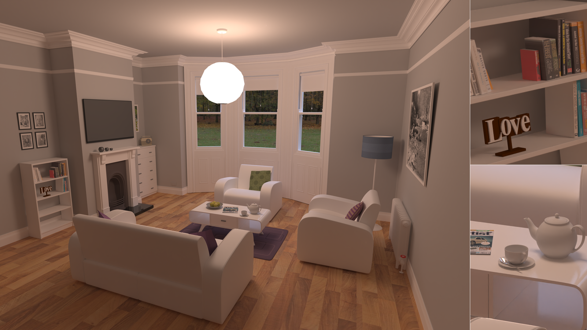

## Building

### Dependencies

编译Atrc时须额外准备的依赖项如下：

* [cmake](https://cmake.org/) (>=3.10)
* 支持C++17标准主要特性的MSVC或clang++（g++理论上可用，但未经测试）

已经由项目文件自带的依赖项如下：

* [agz-utils](https://github.com/AirGuanZ/agz-utils)，提供数学计算、图像加载等基本功能
* [cxxopts](https://github.com/jarro2783/cxxopts)，用于命令行参数解析
* [nlohmann json](https://github.com/nlohmann/json)，用于JSON配置文件的解析
* [stl reader](https://github.com/sreiter/stl_reader)，用于解析STL模型文件
* [tiny obj loader](https://github.com/syoyo/tinyobjloader)，用于解析OBJ模型文件

可选的、在构建时由项目自动下载的依赖项如下：

* [Embree 3.5.2](https://www.embree.org/)，用于加速射线与几何体的求交
* [oidn](https://openimagedenoise.github.io/)，基于机器学习的降噪滤波器

### CMake Options

| 选项名     | 默认值 | 含义                                                   |
| ---------- | ------ | ------------------------------------------------------ |
| USE_EMBREE | OFF    | 启用Embree加速器，这会使得项目在构建时自动下载Embree库 |
| USE_OIDN   | OFF    | 启用OIDN降噪器，这需要预先在外部准备OIDN库             |

注意到OIDN只支持64位程序，因此若启用了OIDN库，必须以64位模式构建程序。

### Example

以Windows环境为例，若启用Embree、OIDN等可选功能，典型的构建过程如下：

1. 在`PowerShell`中运行命令：

   ```powershell
   git clone --recursive --depth=1 https://github.com/AirGuanZ/Atrc
   ```

4. 在`PowerShell`中继续运行命令：

   ```powershell
   mkdir build
   cd build
   cmake -DUSE_EMBREE=ON -DUSE_OIDN=ON -G "Visual Studio 15 2017 Win64" ..
   ```

这会在`Atrc/build`下生成`Visual Studio 2017`的解决方案文件。第一次运行时会自动从网络上下载Embree和OIDN，此时应保持网络良好。

## Usage

### Components

编译Atrc得到的结果由以下几部分构成：

1. CLI，为渲染器的命令行可执行程序
2. obj_to_scene，用于将一个带材质的obj文件转换为Atrc可用的JSON描述格式
3. 一个或多个以共享库形式出现的材质插件

本节主要介绍CLI的使用，即其命令参数的含义和场景配置文件的编写。

### CLI Usage

在终端中运行命令：

```shell
CLI --help
```

可以查看CLI的命令行参数。典型的使用方法是：

```shell
CLI -d render_config.json
```

其中`scene_config.json`是描述了场景信息和渲染设置的配置文件，其编写方法在之后详细描述。也可以查看渲染器支持的所有特性描述：

```shell
CLI --list
```

## Configuration

Atrc使用JSON作为描述场景和渲染设置的配置文件格式。整个JSON文件由两部分构成：

```json
{
    "scene": {
        ...
    },
    "rendering": {
        ...
    }
}
```

其中`scene`为一个类型为`Scene`的场景描述对象（见后文），描述物体、材质、光源等，`rendering`部分描述渲染配置，如摄像机、渲染算法、后处理流程等。


一个简单的配置文件示例如下，它的渲染结果是上图所示的略粗糙的金属球：

```json
{
  "scene": {
    "type": "default",
    "entities": [
      {
        "type": "geometric",
        "geometry": {
          "type": "sphere",
          "radius": 1.6,
          "transform": []
        },
        "material": {
          "type": "disney_reflection",
          "base_color": {
            "type": "constant",
            "texel": [ 0.7 ]
          },
          "metallic": {
            "type": "constant",
            "texel": [ 1 ]
          },
          "roughness": {
            "type": "constant",
            "texel": [ 0.15 ]
          }
        }
      }
    ],
    "env": {
      "type": "env",
      "tex": {
        "type": "hdr",
        "filename": "${scene-directory}/gray_pier_4k.hdr"
      }
    }
  },
  "rendering": {
    "camera": {
      "type": "pinhole",
      "pos": [ 0, -5, 1 ],
      "dst": [ 0, 0, 0 ],
      "up": [ 0, 0, 1 ],
      "width": 0.2,
      "dist": 0.16
    },
    "film": {
      "type": "native",
      "filter": {
        "type": "box",
        "radius": 0.5
      },
      "width": 640,
      "height": 640
    },
    "renderer": {
      "type": "pt",
      "worker_count": -1,
      "task_grid_size": 16,
      "integrator": {
        "type": "native_vol",
        "min_depth": 5,
        "max_depth": 20,
        "cont_prob": 0.9,
        "sample_all_lights": true
      },
      "sampler": {
        "type": "native",
        "spp": 100
      }
    },
    "reporter": {
      "type": "stdout"
    },
    "post_processors": [
      {
        "type": "flip",
        "vertically": true
      },
      {
        "type": "save_to_png",
        "filename": "${scene-directory}/output.png",
        "inv_gamma": 2.2
      }
    ]
  }
}
```

可以看到，Atrc的配置文件由一系列JSON对象嵌套构成，每个字段都有其类型和取值。下面列举一些常见的字段类型的语法（同一字段类型可能有多种写法）：

| 字段类型 | 语法示例                    | 含义                             |
| -------- | --------------------------- | -------------------------------- |
| int      | -1                          | 值为-1的整数                     |
| real     | 1.2                         | 值为1.2的浮点数                  |
| bool     | true                        | 值为真的布尔量；假对应false      |
| string   | "minecraft"                 | 值为"minecraft"的字符串          |
| Spectrum | [ 0.5 ]                     | 值为{ 0.5, 0.5, 0.5 }的RGB三元组 |
| Spectrum | [ 0.1, 0.2, 0.3 ]           | 值为{ 0.1, 0.2, 0.3 }的RGB三元组 |
| Vec2     | [ 2 ]                       | 值为{ 2, 2 }的二维向量           |
| Vec2     | [ 1, 2 ]                    | 值为{ 1, 2 }的二维向量           |
| Vec3     | [ 2 ]                       | 值为{ 2, 2, 2 }的三维向量        |
| Vec3     | [ 1, 2, 3 ]                 | 值为{ 1, 2, 3 }的三维向量        |
| [Type]   | [Instance0, Instance1, ...] | 由类型为Type的字段构成的JSON数组 |

当一个字符串表示的是路径或文件名时，其中的`${scene-directory}`表示配置文件所在目录的绝对路径，`${working-directory}`则表示当前可执行程序工作目录的绝对路径。以上面示例配置文件末尾处的`${scene-directory}/output.png`为例，它表示配置文件所处目录下的`output.png`文件。

除了这些类型的字段外，其他类型的字段均以JSON对象的语法出现。这些字段除了具有“类型”这一属性外，还具有“类型值”的属性。譬如，一个类型为“Entity”的字段可以出现在任何一个需要“实体”的地方，而该字段的类型值则由它的属性`type`决定，表示该字段具体是哪一种实体。

在后文的叙述中，我将使用简化的表格形式来表示一个对象应包含哪些字段以及这些字段的含义。以整个配置文件中最后出现的后处理器`save_to_png`为例，它的JSON表示是：

```json
{
	"type": "save_to_png",
	"filename": "${scene-directory}/output.png",
	"inv_gamma": 2.2
}
```

它对应的文档表格为：

| 字段名    | 类型   | 默认值 | 含义                                           |
| --------- | ------ | ------ | ---------------------------------------------- |
| filename  | string |        | 将图像保存至何处                               |
| inv_gamma | real   | 1      | 保存前对图像进行gamma校正时使用的gamma值的倒数 |
| open      | bool   | true   | 保存完成后是否使用系统的默认图像浏览器将其打开 |

表格中，“默认值”一栏为空表示这是一个必须填写的字段，不为空则表示这是一个可选的字段。

### Rendering Settings

本节描述渲染配置文件中的`rendering`一项包含哪些字段。

| 字段名          | 类型             | 默认值 | 含义                       |
| --------------- | ---------------- | ------ | -------------------------- |
| camera          | Camera           |        | 用于观察场景的摄像机       |
| film            | Film             |        | 用于存放渲染结果           |
| renderer        | Renderer         |        | 渲染算法                   |
| reporter        | ProgressReporter |        | 用何种方式输出渲染进度     |
| post_processors | [PostProcessor]  | []     | 图像后处理器，默认为空列表 |

### Scene

本节描述类型为`Scene`的字段有哪些可取的类型值。

#### default

| 字段名    | 类型            | 默认值           | 含义                                         |
| --------- | --------------- | ---------------- | -------------------------------------------- |
| entities  | [Entity]        | []               | 场景中的实体列表，默认为空列表               |
| env       | Entity          | null             | 表示环境光的实体，默认为无环境光             |
| aggregate | EntityAggregate | native aggregate | 实体间的空间查询加速数据结构，默认为暴力遍历 |

注意到`env`字段的类型也是实体`Entity`，这是由于在Atrc中光源也是一种特殊的实体。

### EntityAggregate

对于射线和实体间的求交，Atrc使用两级加速数据结构（参考RTX的设计），其中实体内部为一级，实体间为一级。`EntityAggregate`就是实体间加速数据结构对应的字段类型，本节描述它有哪些可取的类型值。

#### native

不包含任何字段。表示暴力遍历所有实体。

#### bvh

用BVH树将实体组织起来。

| 字段名        | 类型 | 默认值 | 含义                         |
| ------------- | ---- | ------ | ---------------------------- |
| max_leaf_size | int  | 5      | 一个叶节点最多包含多少个实体 |

### Camera

本节描述类型为`Camera`的字段有哪些可取的类型值。

#### pinhole

| 字段名 | 类型 | 默认值 | 含义                                 |
| ------ | ---- | ------ | ------------------------------------ |
| pos    | Vec3 |        | 观察者位置                           |
| dst    | Vec3 |        | 摄像机看向哪一点，                   |
| up     | Vec3 |        | 用于指定摄像机侧向翻转方向           |
| width  | real |        | 摄像机传感器方阵在世界坐标系中的宽度 |
| dist   | real |        | 小孔和传感器方阵间的距离             |

小孔摄像机的渲染结果是上下颠倒的，因此通常会和类型值为“flip”的后处理器配合。

### Entity

本节描述类型为`Entity`的字段有哪些可取的类型值。

#### diffuse

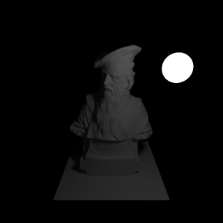

几何漫射光源，即具有几何形状的光源，表面上每一点向所有方向发射相同的辐射亮度。

| 字段名   | 类型     | 默认值 | 含义     |
| -------- | -------- | ------ | -------- |
| geometry | Geometry |        | 几何形状 |
| radiance | Spectrum |        | 辐射亮度 |
| med_in   | Medium   | void   | 内部介质，默认为真空 |
| med_out  | Medium   | void   | 外部介质，默认为真空 |

#### geometric

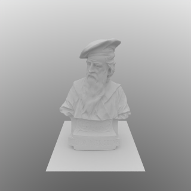

普通的物体，可指定其几何形状、材质和内外介质。

| 字段名   | 类型     | 默认值 | 含义                 |
| -------- | -------- | ------ | -------------------- |
| geometry | Geometry |        | 几何形状             |
| material | Material |        | 实体表面材质         |
| med_in   | Medium   | void   | 内部介质，默认为真空 |
| med_out  | Medium   | void   | 外部介质，默认为真空 |

#### dir

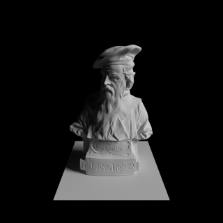

环境光的一种，在指定的锥形立体角范围内的方向上有值为常量的辐射亮度。

| 字段名   | 类型     | 默认值 | 含义                                     |
| -------- | -------- | ------ | ---------------------------------------- |
| dir      | Vec3     |        | 主方向                                   |
| radiance | Spectrum |        | 辐射亮度                                 |
| range    | real     |        | 有效的方向范围有多大，取值范围为$(0, 1)$ |
| med_in   | Medium   | void   | 内部介质，默认为真空 |
| med_out  | Medium   | void   | 外部介质，默认为真空 |

我们知道，环境光可以由方向的函数$L(d)$描述，表示沿方向向量$d$的环境光辐射亮度。设`dir`字段值为$d_0$，`radiance`字段值为$L_0$，`range`字段取值为$r$，则`dir`环境光对应的函数$L$为：
$$
L(d) = \begin{cases}\begin{aligned}
	&L_0, &\cos\langle d, d_0\rangle \ge 1 - r \\
	&0, &\text{otherwise}
\end{aligned}\end{cases}
$$

#### env

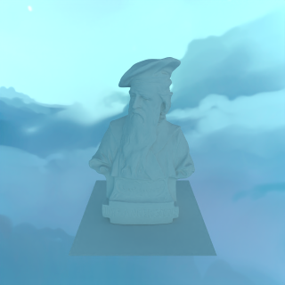

环境光的一种，由纹理给出它在每个方向上的辐射亮度。

| 字段名 | 类型    | 默认值      | 含义                                           |
| ------ | ------- | ----------- | ---------------------------------------------- |
| tex    | Texture |             | 描述辐射亮度的纹理对象                         |
| up     | Vec3    | [ 0, 0, 1 ] | 描述世界空间中哪个方向为“上方”，默认为$+z$方向 |
| med_in   | Medium   | void   | 内部介质，默认为真空 |
| med_out  | Medium   | void   | 外部介质，默认为真空 |

#### native_sky

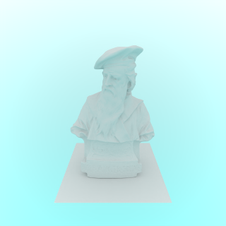

环境光的一种，表示自上而下颜色渐变的天空。

| 字段名 | 类型     | 默认值      | 含义                             |
| ------ | -------- | ----------- | -------------------------------- |
| top    | Spectrum |             | 最上方的辐射亮度                 |
| bottom | Spectrum |             | 最下方的辐射亮度                 |
| up     | Vec3     | [ 0, 0, 1 ] | 哪个方向为“上方”，默认为$+z$方向 |
| med_in   | Medium   | void   | 内部介质，默认为真空 |
| med_out  | Medium   | void   | 外部介质，默认为真空 |

#### aggregate

环境光的一种，表示将多个其他类型的环境光叠加。

| 字段名 | 类型     | 默认值 | 含义                           |
| ------ | -------- | ------ | ------------------------------ |
| impls  | [Entity] |        | 由其他环境光对象构成的JSON数组 |
| med_in   | Medium   | void   | 内部介质，默认为真空 |
| med_out  | Medium   | void   | 外部介质，默认为真空 |

### FilmFilter

渲染图像的过程也是对图像平面进行采样-重建的过程，`FilmFilter`就是用于重建的滤波函数，详细可参见[此文](http://alvyray.com/Memos/CG/Microsoft/6_pixel.pdf)。若对这部分内容不甚了解，推荐使用最简单的重建滤波函数：

```json
"type": "box",
"radius": 0.5
```

#### box

最简单的正方形滤波函数，半径取为0.5时恰好和单个像素重合。

| 字段名 | 类型 | 默认值 | 含义                         |
| ------ | ---- | ------ | ---------------------------- |
| radius | real |        | 滤波函数非零半径，单位为像素 |

#### gaussian

Gaussian滤波函数。

| 字段名 | 类型 | 默认值 | 含义                         |
| ------ | ---- | ------ | ---------------------------- |
| radius | real |        | 滤波函数非零半径，单位为像素 |
| alpha  | real |        | gaussian函数参数$\alpha$     |

### Film

用于存储渲染得到的图像。

#### native

最基础的的点阵存储，支持位置、深度、材质颜色和法线等属性构成的G-Buffer。

| 字段名 | 类型 | 默认值 | 含义               |
| ------ | ---- | ------ | ------------------ |
| width  | int  |        | 以像素为单位的宽度 |
| height | int  |        | 以像素为单位的高度 |

#### filtered

支持任意重建滤波函数的点阵存储，支持位置、深度、材质颜色和法线等属性构成的G-Buffer。

| 字段名 | 类型       | 默认值 | 含义                   |
| ------ | ---------- | ------ | ---------------------- |
| width  | int        |        | 以像素为单位的宽度     |
| height | int        |        | 以像素为单位的高度     |
| filter | FilmFilter |        | 重建图像使用的滤波函数 |

### Fresnel

表示物体表面材质中的fresnel项。

#### always_one

值永远为1的fresnel项，表示能量的反射/折射比为$\infty$。

#### dielectric

电介质的fresnel项。

| 字段名  | 类型    | 默认值 | 含义       |
| ------- | ------- | ------ | ---------- |
| eta_out | Texture |        | 外部折射率 |
| eta_in  | Texture |        | 内部折射率 |

#### conductor

导体的fresnel项

| 字段名  | 类型    | 默认值 | 含义       |
| ------- | ------- | ------ | ---------- |
| eta_out | Texture |        | 外部折射率 |
| eta_in  | Texture |        | 内部折射率 |
| k       | Texture |        | 吸收率     |

### Geometry

用于描述物体的几何形状。

绝大部分几何形状都包含类型为`[Transform]`的`transform`字段，即一系列`Transform`的序列。值得注意的是，序列中后面的`Transform`先作用到物体上，前面的`Transform`后作用到物体上。

#### disk

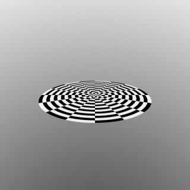

单面圆盘。

| 字段名    | 类型        | 默认值 | 含义                                 |
| --------- | ----------- | ------ | ------------------------------------ |
| transform | [Transform] |        | 从本地坐标系到世界坐标系中的变换序列 |
| radius    | real        |        | 圆盘半径                             |

#### double_sided

双面适配器，它将一个单面几何形状转为双面，主要适用于圆盘、三角形等面片形式的几何形状。

| 字段名   | 类型     | 默认值 | 含义                     |
| -------- | -------- | ------ | ------------------------ |
| internal | Geometry |        | 被从单面转为双面的几何体 |

#### quad

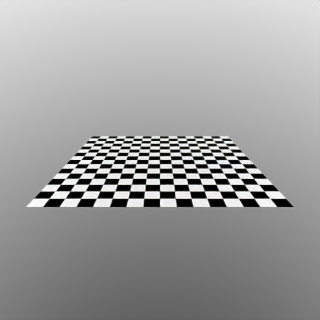

单面四边形$ABCD$，由两个三角形$ABC$和$ACD$构成。

| 字段名    | 类型        | 默认值 | 含义                                 |
| --------- | ----------- | ------ | ------------------------------------ |
| transform | [Transform] |        | 从本地坐标系到世界坐标系中的变换序列 |
| A         | Vec3        |        | 顶点A的坐标                          |
| B         | Vec3        |        | 顶点B的坐标                          |
| C         | Vec3        |        | 顶点C的坐标                          |
| D         | Vec3        |        | 顶点D的坐标                          |
| tA        | Vec2        |        | 顶点A的纹理坐标                      |
| tB        | Vec2        |        | 顶点B的纹理坐标                      |
| tC        | Vec2        |        | 顶点C的纹理坐标                      |
| tD        | Vec2        |        | 顶点D的纹理坐标                      |

#### sphere

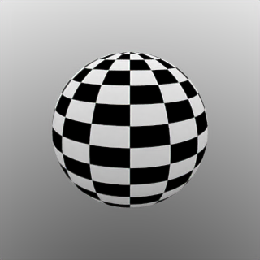

单面球体，面向外侧。

| 字段名    | 类型        | 默认值 | 含义                                 |
| --------- | ----------- | ------ | ------------------------------------ |
| transform | [Transform] |        | 从本地坐标系到世界坐标系中的变换序列 |
| radius    | real        |        | 球体半径                             |

#### triangle

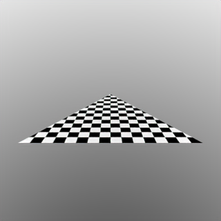

单面三角形。

| 字段名    | 类型        | 默认值 | 含义                                 |
| --------- | ----------- | ------ | ------------------------------------ |
| transform | [Transform] |        | 从本地坐标系到世界坐标系中的变换序列 |
| A         | Vec3        |        | 顶点A的坐标                          |
| B         | Vec3        |        | 顶点B的坐标                          |
| C         | Vec3        |        | 顶点C的坐标                          |
| tA        | Vec2        |        | 顶点A的纹理坐标                      |
| tB        | Vec2        |        | 顶点B的纹理坐标                      |
| tC        | Vec2        |        | 顶点C的纹理坐标                      |

#### triangle_bvh

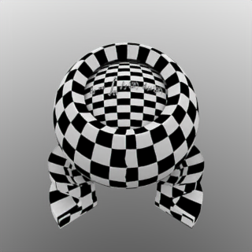

以BVH树组织而成的三角形网格形状，在启用了Embree时使用Embree实现，否则使用自行构建的BVH树。

| 字段名       | 类型        | 默认值 | 含义                                                   |
| ------------ | ----------- | ------ | ------------------------------------------------------ |
| transform    | [Transform] |        | 从本地坐标系到世界坐标系中的变换序列                   |
| pretransform | bool        | false  | 是否预先在对网格进行变换，使位于原点附近的单位立方体内 |
| filename     | string      |        | 模型文件路径，支持OBJ文件和STL文件                     |

#### triangle_bvh_embree

使用Embree实现的三角形网格形状，参数和`triangle_bvh`相同。

#### triangle_bvh_noembree

不使用Embree实现的三角形网格形状，参数和`triangle_bvh`相同。

### Material

材质描述了物体表面与光的交互过程，本节介绍类型为`Material`的字段可取的类型值。

#### disney_reflection


Disney Principled BRDF的完整实现，有的参数含义我不知道怎么翻译比较合适，所以最好参考[原文](https://disney-animation.s3.amazonaws.com/library/s2012_pbs_disney_brdf_notes_v2.pdf)。

| 字段名          | 类型    | 默认值   | 含义                                       |
| --------------- | ------- | -------- | ------------------------------------------ |
| base_color      | Texture |          | 基本颜色                                   |
| metallic        | Texture |          | 金属度                                     |
| roughness       | Texture |          | 粗糙度                                     |
| subsurface      | Texture | all_zero | 次表面散射度，注意这并不是BSSRDF，只是近似 |
| specular        | Texture | all_zero | 高光度                                     |
| specular_tint   | Texture | all_zero | 高光颜色一致性                             |
| anisotropic     | Texture | all_zero | 各向异性度                                 |
| sheen           | Texture | all_zero | 边缘光泽度                                 |
| sheen_tint      | Texture | all_zero | 边缘光泽颜色一致性                         |
| clearcoat       | Texture | all_zero | 清漆强度                                   |
| clearcoat_gloss | Texture | all_zero | 清漆光泽度                                 |

#### disney

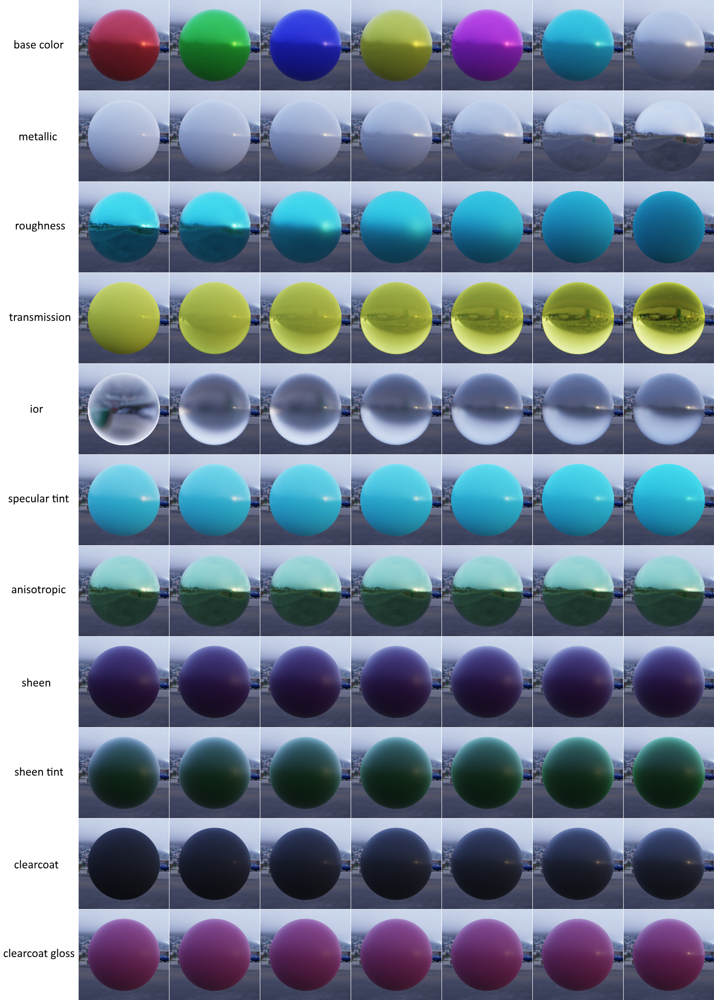

不带BSSRDF的Disney Principled BSDF，具体可参考[原文](https://blog.selfshadow.com/publications/s2015-shading-course/#course_content)。

| 字段名           | 类型    | 默认值    | 含义                                              |
| ---------------- | ------- | --------- | ------------------------------------------------- |
| base_color       | Texture |           | 基本颜色，取值范围为$[0, 1]^3$                    |
| metallic         | Texture |           | 金属度，取值范围为$[0,1]$                         |
| roughness        | Texture |           | 粗糙度，取值范围为$[0.01,1]$                      |
| specular_tint    | Texture | all_zero  | 高光颜色一致性，取值范围为$[0,1]$                 |
| anisotropic      | Texture | all_zero  | 各向异性度，取值范围为$[0,1]$                     |
| sheen            | Texture | all_zero  | 边缘光泽度，取值范围为$[0,1]$                     |
| sheen_tint       | Texture | all_zero  | 边缘光泽颜色一致性，取值范围为$[0,1]$             |
| clearcoat        | Texture | all_zero  | 清漆强度，取值范围为$[0,1]$                       |
| clearcoat_gloss  | Texture | all_zero  | 清漆光泽度，取值范围为$[0,1]$                     |
| transmission     | Texture | all_zero  | 透明度，取值范围为$[0,1]$                         |
| ior              | Texture | all_{1.5} | 内外折射率之比，取值范围为$[0,\infty)$            |
| scatter_distance | Texture | all_zero  | mean free path length (for subsurface scattering) |

#### frosted_glass

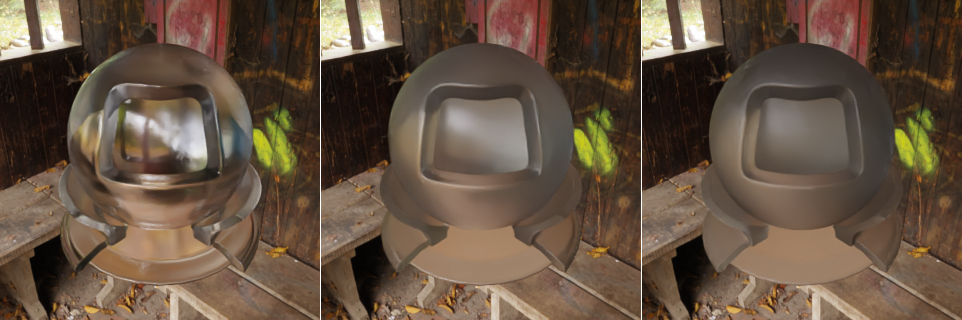

磨砂玻璃材质，详情请参考[Microfacet Models for Refraction through Rough Surfaces](https://www.cs.cornell.edu/~srm/publications/EGSR07-btdf.html)。

| 字段名    | 类型    | 默认值 | 含义      |
| --------- | ------- | ------ | --------- |
| color_map | Texture |        | 表面颜色  |
| fresnel   | Fresnel |        | Fresnel项 |
| roughness | Texture |        | 粗糙度    |

#### glass

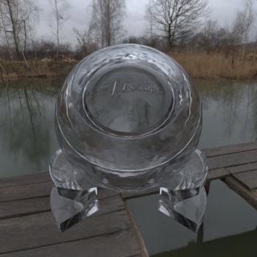

光滑玻璃材质。

| 字段名    | 类型    | 默认值 | 含义      |
| --------- | ------- | ------ | --------- |
| color_map | Texture |        | 表面颜色  |
| fresnel   | Fresnel |        | Fresnel项 |

#### ideal_black

完全吸收材质，也就是一团黑。

#### ideal_diffuse

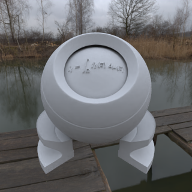

理想漫反射，反射到各方向的辐射亮度均相同。

| 字段名 | 类型    | 默认值 | 含义     |
| ------ | ------- | ------ | -------- |
| albedo | Texture |        | 表面颜色 |

#### mirror

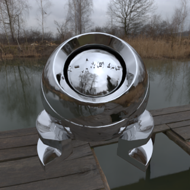

理想镜面。

| 字段名  | 类型    | 默认值 | 含义      |
| ------- | ------- | ------ | --------- |
| rc_map  | Texture |        | 表面颜色  |
| fresnel | Fresnel |        | Fresnel项 |

#### mtl

由Wavefront MTL文件描述的材质，也就是标准的漫反射+高光。

| 字段名 | 类型    | 默认值 | 含义       |
| ------ | ------- | ------ | ---------- |
| kd     | Texture |        | 漫反射强度 |
| ks     | Fresnel |        | 高光强度   |
| ns     | Texture |        | 高光光泽度 |

#### add

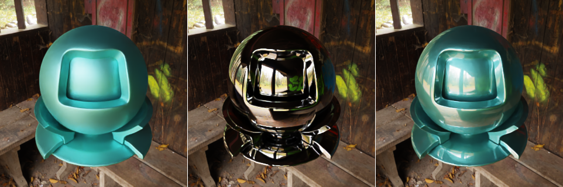

把多个材质直接叠加到一起。上图中的第三幅是使用`add`和`scale`配合，将前两幅图像中的物体材质按$1/2$的权重求和得到的效果。

| `字段名 | 类型       | 默认值 | 含义             |
| ------- | ---------- | ------ | ---------------- |
| mats    | [Material] |        | 被叠加的材质数组 |

#### scaler

线性地缩放一个材质的反射/折射亮度。

| 字段名   | 类型     | 默认值 | 含义         |
| -------- | -------- | ------ | ------------ |
| internal | Material |        | 被缩放的材质 |
| scale    | Texture  |        | 缩放比       |

#### subsurface

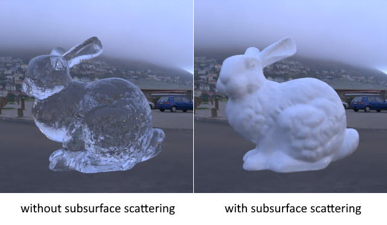

次表面散射材质，基于`ConstantBSSRDF`实现。

| 字段名  | 类型     | 默认值 | 含义                                         |
| ------- | -------- | ------ | -------------------------------------------- |
| surface | Material |        | 覆盖在表面的一层材质，一般来说应包含折射分量 |
| A       | Texture  |        | surface albedo                               |
| d       | Texture  |        | mean free path length                        |
| ior     | Texture  |        | inner IOR / outer IOR                        |

#### mirror_varnish

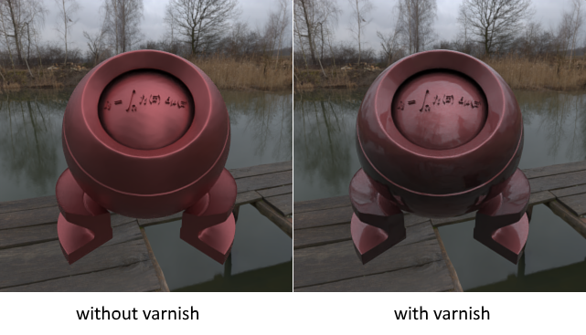

表面绝对光滑的清漆，其内部必须是不透明材质。

| 字段名   | 类型     | 默认值 | 含义             |
| -------- | -------- | ------ | ---------------- |
| internal | Material |        | 清漆内部的材质   |
| eta_in   | Texture  |        | 清漆内部的折射率 |
| eta_out  | Texture  |        | 清漆外部的折射率 |
| color    | Texture  |        | 清漆颜色         |

#### lib

以外部共享库形式存在的材质，详情请见后文。

| 字段名   | 类型   | 默认值 | 含义           |
| -------- | ------ | ------ | -------------- |
| filename | string |        | 共享库文件路径 |

### Medium

物体内部介质的描述。

#### void

真空，也就是什么介质也没有。

#### absorbtion

无散射的介质。

| 字段名  | 类型     | 默认值 | 含义   |
| ------- | -------- | ------ | ------ |
| sigma_a | Spectrum |        | 吸收率 |

#### homogeneous

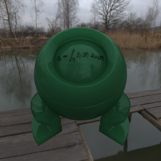

各处散射性质均相同的介质。

| 字段名  | 类型     | 默认值 | 含义               |
| ------- | -------- | ------ | ------------------ |
| sigma_a | Spectrum |        | 吸收率             |
| sigma_s | Spectrum |        | 散射率             |
| g       | real     |        | 散射方向的不对称度 |

### Post Processor

在渲染完成后用于图像处理的后处理器。

#### flip

翻转图像。

| 字段名       | 类型 | 默认值 | 含义                     |
| ------------ | ---- | ------ | ------------------------ |
| vertically   | bool | false  | 是否在垂直方向上翻转图像 |
| horizontally | bool | false  | 是否在水平方向上翻转图像 |

#### gamma

对图像进行gamma校正。

| 字段名    | 类型 | 默认值 | 含义         |
| --------- | ---- | ------ | ------------ |
| gamma     | real |        | $\gamma$值   |
| inv_gamma | real |        | $1/\gamma$值 |

`gamma`和`inv_gamma`只需给出其中一个即可。

#### oidn_denoiser

使用OIDN对图像进行降噪，注意最好使用支持G-Buffer的`Flim`和`Renderer`。

| 字段名 | 类型 | 默认值 | 含义                              |
| ------ | ---- | ------ | --------------------------------- |
| clamp  | bool | false  | 降噪前是否将图像颜色clamp至[0, 1] |

#### save_gbuffer_to_png

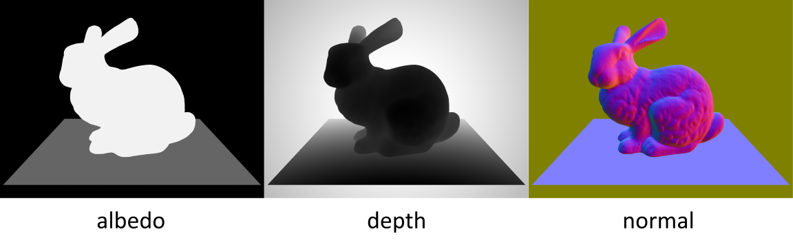

将G-Buffer保存至png文件。

| 字段名 | 类型   | 默认值 | 含义                 |
| ------ | ------ | ------ | -------------------- |
| albedo | string | ""     | 将材质颜色保持至何处 |
| normal | string | ""     | 将法线保存至何处     |
| depth  | string | ""     | 将场景深度保存至何处 |

当使用的`Film`或`Renderer`不支持G-Buffer时，保存的结果是无意义的。

#### save_to_png

将图像保存至png文件。

| 字段名    | 类型   | 默认值 | 含义                                    |
| --------- | ------ | ------ | --------------------------------------- |
| filename  | string |        | 将图像保存至何处                        |
| open      | bool   | true   | 保存完成后是否使用默认图像浏览器打开它  |
| gamma     | real   | 1      | 保存前进行gamma校正时使用的$\gamma$值   |
| inv_gamma | real   | 1      | 保存前进行gamma校正时使用的$1/\gamma$值 |

`gamma`和`inv_gamma`只需给出其中一个即可，若都未指定，则不进行gamma校正。

### Renderer

渲染算法。

#### pt

最传统的路径追踪，可以通过`integrator`来指定使用怎样的追踪策略。

| 字段名         | 类型                  | 默认值 | 含义                                                   |
| -------------- | --------------------- | ------ | ------------------------------------------------------ |
| integrator     | PathTracingIntegrator |        | 路径追踪策略                                           |
| worker_count   | int                   |        | 工作线程数                                             |
| task_grid_size | int                   | 32     | 图像被划分为许多正方形小块进行渲染，这里指定了小块边长 |
| sampler        | Sampler               |        | 随机数采样器                                           |

当工作线程数$n \le 0$时，设硬件线程数为$k$，则将使用$\max\{1, k+n\}$个工作线程。比如可以将`worker_count`设置为-2，表示留两个硬件线程，把其他硬件线程都用起来。

#### light

Adjoint Particle Tracer的实现，收敛很慢，主要为学习用途。

| 字段名         | 类型    | 默认值 | 含义                           |
| -------------- | ------- | ------ | ------------------------------ |
| worker_count   | int     |        | 工作线程数                     |
| min_depth      | int     |        | 使用RR策略前的最小粒子追踪深度 |
| max_depth      | int     |        | 追踪粒子的最大截断深度         |
| cont_prob      | real    |        | 追踪粒子时使用RR策略的通过概率 |
| particle_count | int     |        | 共追踪多少个粒子               |
| sampler        | Sampler |        | 随机数采样器                   |

在追踪一条路径时，有三个追踪参数`min_depth`，`max_depth`和`cont_prob`值得注意。当追踪深度超过`min_depth`后，将以`cont_prob`为通过概率使用Russian Roulette策略来终止路径；而在路径深度超过`max_depth`时，它将被无条件终止。

### PathTracingIntegrator

`PathTracingIntegrator`用于描述path tracing算法中追踪何种路径。

#### direct

使用Multiple Importance Sampling技术计算直接光照。

| 字段名            | 类型 | 默认值 | 含义                                             |
| ----------------- | ---- | ------ | ------------------------------------------------ |
| sample_all_lights | bool |        | 每次采样时是遍历所有光源还是随机抽取一个进行采样 |

#### isolated

用于突出展示个别物体的追踪策略，可单独指定背景纹理。

| 字段名     | 类型    | 默认值 | 含义                                 |
| ---------- | ------- | ------ | ------------------------------------ |
| min_depth  | int     |        | 使用RR策略前的最小粒子追踪深度       |
| max_depth  | int     |        | 追踪粒子的最大截断深度               |
| cont_prob  | real    |        | 追踪粒子时使用RR策略的通过概率       |
| env        | Texure  |        | 用于对物体进行着色的环境光纹理       |
| background | Texture |        | 用于填充背景的纹理，同样使用环境映射 |

#### native

没有任何优化技巧的暴力路径追踪，支持介质渲染。

| 字段名    | 类型 | 默认值 | 含义                       |
| --------- | ---- | ------ | -------------------------- |
| min_depth | int  |        | 使用RR策略前的最小路径深度 |
| max_depth | int  |        | 路径的最大截断深度         |
| cont_prob | real |        | 追踪时使用RR策略的通过概率 |

#### mis

使用Multiple Importance Sampling技术优化的路径追踪，支持介质渲染。

| 字段名            | 类型 | 默认值 | 含义                                             |
| ----------------- | ---- | ------ | ------------------------------------------------ |
| min_depth         | int  |        | 使用RR策略前的最小路径深度                       |
| max_depth         | int  |        | 路径的最大截断深度                               |
| cont_prob         | real |        | 追踪时使用RR策略的通过概率                       |
| sample_all_lights | bool |        | 每次采样时是遍历所有光源还是随机抽取一个进行采样 |

### ProgressReporter

用于输出渲染进度。

#### stdout

输出到标准输出流。

### Sampler

随机数采样器。

#### native

最基本的随机数采样器，所有样本间都是独立的。

| 字段名 | 类型 | 默认值  | 含义                                               |
| ------ | ---- | ------- | -------------------------------------------------- |
| seed   | int  | by time | 种子值，默认使用时间作为种子                       |
| spp    | int  |         | 每像素采样数，注意这一设置对一些特定的Renderer无效 |

### Texture

纹理对象。

所有纹理都包含以下字段（这些字段就不在后面每种纹理中列出了）：

| 字段名    | 类型         | 默认值  | 含义                                                         |
| --------- | ------------ | ------- | ------------------------------------------------------------ |
| inv_v     | bool         | false   | 将v坐标变换为1-v                                             |
| inv_u     | bool         | false   | 将u坐标变换为1-u                                             |
| swap_uv   | bool         | false   | 交换uv坐标                                                   |
| transform | [Transform2] | []      | 对uv坐标实施的仿射变换序列                                   |
| wrap_u    | string       | "clamp" | 对超出$[0, 1]$范围的u坐标的处理方法，有"clamp/repeat/mirror"三种取值 |
| wrap_v    | string       | "clamp" | 对超出$[0, 1]$范围的u坐标的处理方法，有"clamp/repeat/mirror"三种取值 |

值得注意的是，`inv_v, inv_u, swap_uv`和`transform`都是对uv的变换，其中`transform`最先起作用，随后`swap_uv`起作用，`inv_u`和`inv_v`最后起作用。而`transform`序列中，也是前面的变换后起作用，后面的变换先起作用。

#### checker_board

棋盘网格纹理，主要用于测试uv。

| 字段名     | 类型     | 默认值 | 含义                              |
| ---------- | -------- | ------ | --------------------------------- |
| grid_count | real     |        | 棋盘上一条边上被分了多少格        |
| grid_size  | real     |        | $[0, 1]^2$ uv平面上单个格子的边长 |
| color_1    | Spectrum | [ 0 ]  | 一种格子的颜色                    |
| color_2    | Spectrum | [ 1 ]  | 另一种各自的颜色                  |

`grid_count`和`grid_size`中只需给出一个即可，在语义上它们满足`grid_count * grid_size = 1`。

#### constant

常值纹理，即在它的任何部位采样都会获得相同值。

| 字段名 | 类型     | 默认值 | 含义   |
| ------ | -------- | ------ | ------ |
| texel  | Spectrum |        | 纹素值 |

#### hdr

从.hdr文件中加载出的纹理。

| 字段名   | 类型   | 默认值 | 含义        |
| -------- | ------ | ------ | ----------- |
| filename | string |        | hdr文件路径 |

#### image

从各种常见图像文件格式（.bmp，.jpg，.png，.tga等）中加载出的纹理。

| 字段名   | 类型   | 默认值 | 含义         |
| -------- | ------ | ------ | ------------ |
| filename | string |        | 图像文件路径 |

#### scale

对另一纹理对象进行线性放缩的wrapper。

| 字段名   | 类型     | 默认值 | 含义         |
| -------- | -------- | ------ | ------------ |
| scale    | Spectrum |        | 放缩比值     |
| internal | Texture  |        | 被放缩的纹理 |

### Transform

对三维坐标的仿射变换。

#### translate

| 字段名 | 类型 | 默认值 | 含义   |
| ------ | ---- | ------ | ------ |
| offset | Vec3 |        | 平移量 |

#### rotate

| 字段名 | 类型 | 默认值 | 含义     |
| ------ | ---- | ------ | -------- |
| axis   | Vec3 |        | 旋转轴   |
| rad    | real |        | 旋转弧度 |
| deg    | real |        | 旋转角度 |

`rad`和`deg`中只能有一个。

#### rotate_x

绕$x$轴旋转。

| 字段名 | 类型 | 默认值 | 含义     |
| ------ | ---- | ------ | -------- |
| rad    | real |        | 旋转弧度 |
| deg    | real |        | 旋转角度 |

`rad`和`deg`中只能有一个。

#### rotate_y

绕$y$轴旋转。

| 字段名 | 类型 | 默认值 | 含义     |
| ------ | ---- | ------ | -------- |
| rad    | real |        | 旋转弧度 |
| deg    | real |        | 旋转角度 |

`rad`和`deg`中只能有一个。

#### rotate_z

绕$z$轴旋转。

| 字段名 | 类型 | 默认值 | 含义     |
| ------ | ---- | ------ | -------- |
| rad    | real |        | 旋转弧度 |
| deg    | real |        | 旋转角度 |

`rad`和`deg`中只能有一个。

#### scale

各向等比例缩放。

| 字段名 | 类型 | 默认值 | 含义   |
| ------ | ---- | ------ | ------ |
| ratio  | real |        | 缩放比 |

### Transform2

对二维坐标的仿射变换。

#### translate

| 字段名 | 类型 | 默认值 | 含义   |
| ------ | ---- | ------ | ------ |
| offset | Vec2 |        | 平移量 |

#### rotate

| 字段名 | 类型 | 默认值 | 含义     |
| ------ | ---- | ------ | -------- |
| rad    | real |        | 旋转弧度 |
| deg    | real |        | 旋转角度 |

`rad`和`deg`中只能有一个。

#### scale

各向等比例缩放。

| 字段名 | 类型 | 默认值 | 含义   |
| ------ | ---- | ------ | ------ |
| ratio  | real |        | 缩放比 |

## 共享库材质插件

Atrc支持使用C++编写外部材质插件，以共享库的形式在渲染器运行时加载，从而在不需要重新编译渲染器的情况下加入新的材质类型。

## 对同一场景的多次渲染

TODO