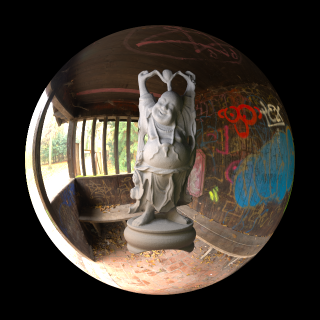

# Atrc Renderer Documentation


[TOC]

## Building

### Dependencies

**Prerequests**

* [cmake](https://cmake.org/) (>=3.10)
* MSVC or clang++ (and libc++) with supporting of major features of C++ 17 (g++ should be ok but is untested)

**Dependencies Contained in Project Source**

* [agz-utils](https://github.com/AirGuanZ/agz-utils) for mathematics and image loading
* [cxxopts](https://github.com/jarro2783/cxxopts) for parsing command-line arguments
* [nlohmann json](https://github.com/nlohmann/json) for parsing comfiguration file
* [stl reader](https://github.com/sreiter/stl_reader) for parsing STL model file
* [tiny obj loader](https://github.com/syoyo/tinyobjloader) for parsing OBJ model file

**Optional Dependencies (Automatically Downloaded in Building)**

* [Embree 3.6.1](https://www.embree.org/) for better ray-mesh intersection test
* [oidn](https://openimagedenoise.github.io/) for denoising
* [glfw](https://www.glfw.org/) for managing OpenGL context of Material Explorer

### CMake Options

| 选项名                  | Default Value | Explanation                        |
| ----------------------- | ------------- | ---------------------------------- |
| USE_EMBREE              | OFF           | use Embree library to tracing rays |
| USE_OIDN                | OFF           | use OIDN denoising library         |
| BUILD_MATERIAL_EXPLORER | OFF           | build Material Explorer            |

**Note**. OIDN is 64-bit only.

### Example

**Full-featured Building on Windows**

Run following command in `PowerShell`：

```powershell
git clone --recursive --depth=1 https://github.com/AirGuanZ/Atrc
cd Atrc
mkdir build
cd build
cmake -DUSE_EMBREE=ON -DUSE_OIDN=ON -DBUILD_MATERIAL_EXPLORER=ON -G "Visual Studio 15 2017 Win64" ..
```

`Embree`, `OIDN` and `glfw` will be automatically downloaded during the first build.

**Full-featured Building on *nix**

```shell
git clone --recursive --depth=1 https://github.com/AirGuanZ/Atrc
cd Atrc
mkdir build
cd build
export CC=clang
export CXX=clang++
cmake -DUSE_EMBREE=ON -DUSE_OIDN=ON -DBUILD_MATERIAL_EXPLORER=ON -G "Unix Makefiles" ..
```

## Usage

### Components

1. CLI, command-line interface of the off-line renderer
2. Tracer, off-line rendering library based on ray tracing
3. obj_to_scene, tool for converting OBJ file to Atrc entity list
4. material_explorer, GPU-accelerated material explorer
5. CLI_RAS, renderer with rasterization pipeline (under development)

### CLI Usage

Use following command to print help information:

```shell
CLI --help
```

Typical usage looks like:

```shell
CLI -d render_config.json
```

in which `scene_config.json` is a configuration file describing scene information and rendering settings.

Use following command to print all supported features:

```shell
CLI --list
```

## Configuration

Atrc uses JSON to describe scene and rendering settings. The input JSON file must contains two parts:

```json
{
    "scene": {
        ...
    },
    "rendering": {
        ...
    }
}
```

where `scene` is a scene object with type `Scene` (interrupted later). `rendering` specifies rendering settings like camera, global illumination algorithm, progress reporter, and post processors.


Here is a simple example, which results in the above image (a bit rough metal sphere):

```json
{
  "scene": {
    "type": "default",
    "entities": [
      {
        "type": "geometric",
        "geometry": {
          "type": "sphere",
          "radius": 1.6,
          "transform": []
        },
        "material": {
          "type": "disney",
          "base_color": {
            "type": "constant",
            "texel": [ 0.7 ]
          },
          "metallic": {
            "type": "constant",
            "texel": [ 1 ]
          },
          "roughness": {
            "type": "constant",
            "texel": [ 0.15 ]
          }
        }
      }
    ],
    "lights": [
      {
        "type": "ibl",
        "tex": {
          "type": "hdr",
          "filename": "${scene-directory}/gray_pier_4k.hdr"
        }
      }
    ]
  },
  "rendering": {
    "camera": {
      "type": "pinhole",
      "pos": [ 0, -5, 1 ],
      "dst": [ 0, 0, 0 ],
      "up": [ 0, 0, 1 ],
      "width": 0.2,
      "dist": 0.16
    },
    "film": {
      "type": "native",
      "width": 640,
      "height": 640
    },
    "renderer": {
      "type": "pt",
      "worker_count": -1,
      "task_grid_size": 16,
      "integrator": {
        "type": "native"
      },
      "sampler": {
        "type": "native",
        "spp": 100
      }
    },
    "reporter": {
      "type": "stdout"
    },
    "post_processors": [
      {
        "type": "flip",
        "vertically": true
      },
      {
        "type": "save_to_img",
        "filename": "${scene-directory}/output.png",
        "inv_gamma": 2.2
      }
    ]
  }
}
```

As you can see, Atrc's configuration file consists of a series of nested JSON objects, and each field has its type and value. The syntax of some common field types is listed below:

| field type | example                     | semantics                             |
| ---------- | --------------------------- | ------------------------------------- |
| int        | -1                          | integer `1`                           |
| real       | 1.2                         | floating number `1.2`                 |
| bool       | true                        | boolean value `true`                  |
| bool       | false                       | boolean value `false`                 |
| string     | "minecraft"                 | string `minecraft`                    |
| Spectrum   | [ 0.5 ]                     | RGB value `(0.5, 0.5, 0.5)`           |
| Spectrum   | [ 0.1, 0.2, 0.3 ]           | RGB value `(0.1, 0.2, 0.3)`           |
| Vec2       | [ 2 ]                       | 2D vector `(2, 2)`                    |
| Vec2       | [ 1, 2 ]                    | 2D vector `(1, 2)`                    |
| Vec3       | [ 2 ]                       | 3D vector `(2, 2, 2)`                 |
| Vec3       | [ 1, 2, 3 ]                 | 3D vector `(1, 2, 3)`                 |
| [Type]     | [Instance0, Instance1, ...] | JSON array of objects with given Type |

When a string represents a path or file name, `${scene-directory}` represents the absolute path of the directory where the configuration file is located, and `${working-directory}` represents the absolute path of the working directory of the current executable program. Take `${scene-directory}/output.png` at the end of the above example configuration file as an example, it represents the `output.png` file in the directory where the configuration file is located.

Except for above types of fields, other fields appear in the syntax of a JSON object. Each object contains a field `type`, representing its type in Atrc renderer.

In the following description, I will use a simplified tabular form to indicate which fields an object should contain and the meaning of these fields. Taking the last post-processor `save_to_png` in the above configuration file as an example, its JSON representation is:

```json
{
	"type": "save_to_img",
	"filename": "${scene-directory}/output.png",
	"inv_gamma": 2.2
}
```

The corresponding tabular form is:

| Field Name         | Type   | Default Value | Explanation                                            |
| ------------------ | ------ | ------------- | ------------------------------------------------------ |
| filename           | string |               | where to save the output image                         |
| open               | bool   | true          | whether to open it with the default image browser      |
| inv_gamma          | real   | 1             | $1/\gamma$ for gamma correction (typical value is 2.2) |
| with_alpha_channel | bool   | false         | save G-Buffer::binary to the alpha channel             |
| ext                | string | png           | saved file type ("jpg" or "png")                       |

In the form, the "default value" column is blank to indicate that this is a required field, and not blank to indicate that it is an optional field.

### Rendering Settings

This section describes fields included in the `rendering` item.

| Field Name      | Type             | Default Value | Explanation                      |
| --------------- | ---------------- | ------------- | -------------------------------- |
| camera          | Camera           |               | camera for viewing the scene     |
| film            | Film             |               | used to store rendering results  |
| renderer        | Renderer         |               | rendering algorithm              |
| reporter        | ProgressReporter |               | how to output rendering progress |
| post_processors | [PostProcessor]  | []            | image post processors            |

### Scene

This section describes the possible type values for fields of type `Scene`.

**default**

| Field Name | Type            | Default Value    | Explanation                                                  |
| ---------- | --------------- | ---------------- | ------------------------------------------------------------ |
| entities   | [Entity]        | []               | entities in scene                                            |
| lights     | [NonareaLight]  | []               | non-area lights in scene (ibl, for example)                  |
| aggregate  | EntityAggregate | native aggregate | data structure for accelerating ray queries between entities (default is a brute-force one) |
| env        | NonareaLight    | null             | environment light                                            |

`env` is deprecated and exists only for compatibility. It (if presented) will be automatically added to the `lights` array.

### EntityAggregate

For the intersection test between rays and the entities, Atrc uses a two-level data structure (refer to the design of RTX), where the inside of the entity is one level and the one between entities is another level. `EntityAggregate` is the field type corresponding to the data structure between entities.

**native**

`native` doesn't contain any fields, meaning to traversing all entities.

**bvh**

Organize entities with a BVH tree.

| Field Name    | Type | Default Value | Explanation                               |
| ------------- | ---- | ------------- | ----------------------------------------- |
| max_leaf_size | int  | 5             | How many entities a leaf node can contain |

### Camera

This section describes the possible type values for fields of type `Camera`.

**pinhole**

| Field Name | Type | Default Value | Explanation                                 |
| ---------- | ---- | ------------- | ------------------------------------------- |
| pos        | Vec3 |               | eye position                                |
| dst        | Vec3 |               | position looked by the camera               |
| up         | Vec3 |               | see 'lookat' matrix in 3D computer graphics |
| width      | real |               | width of the camera sensor in world space   |
| dist       | real |               | Distance between pinhole and sensor         |
| height     | real |               | height of the camera sensor in world space  |
| aspect     | real |               | width divide by height                      |

You only need to give one for the `height` and `aspect` parameters.

The rendering result of the pinhole camera is upside down, so it usually works with a post processor of type `flip`.

### Entity

**diffuse**


Geometric diffuse light source, that is, a light source with a geometric shape. Each point on the surface emits the same radiance in all directions.

| Field Name | Type  | Default Value | Explanation |
| -------- | -------- | ------ | -------- |
| geometry | Geometry |        | geometric shape |
| radiance | Spectrum |        | emitted radiance |
| med_in   | Medium   | void   | outer medium |
| med_out  | Medium   | void   | inner medium |
| no_denoise | bool | false | disable denoiser on this entity |

**geometric**


Ordinary entity with geometry shape, material and mediums.

| Field Name     | Type     | Default Value | Explanation                |
| -------------- | -------- | ------------- | -------------------------- |
| geometry       | Geometry |               | geometric shape            |
| material       | Material |               | surface material           |
| med_in         | Medium   | void          | outer medium               |
| med_out        | Medium   | void          | inner medium               |
| shadow_catcher | bool     | false         | marked as a shadow catcher |

### FilmFilter

The process of rendering the image is also a process of sampling-reconstructing the image plane. `FilmFilter` is the filter function used for reconstruction. For details, please refer to [this article](http://alvyray.com/Memos/CG/Microsoft/6_pixel. pdf). If you don't know much about this part, it is recommended to use the simplest (but not the best) reconstruction filter function:

```json
"type": "box",
"radius": 0.5
```

**box**

The simplest box filter function, coincides with a single pixel with a radius of 0.5.

| Field Name | Type | Default Value | Explanation             |
| ---------- | ---- | ------------- | ----------------------- |
| radius     | real |               | filter radius in pixels |

**gaussian**

Gaussian filter function

| Field Name | Type | Default Value | Explanation                   |
| ---------- | ---- | ------------- | ----------------------------- |
| radius     | real |               | filter radius in pixels       |
| alpha      | real |               | $\alpha$ in gaussian function |

### Film

**native**

The most basic and fastest film which doesn't support filter function other than box.

| Field Name | Type | Default Value | Explanation            |
| ---------- | ---- | ------------- | ---------------------- |
| width      | int  |               | image width in pixels  |
| height     | int  |               | image height in pixels |

**filtered**

Film supports various types of filter function.

| Field Name | Type       | Default Value | Explanation                            |
| ---------- | ---------- | ------------- | -------------------------------------- |
| width      | int        |               | image width in pixels                  |
| height     | int        |               | image height in pixels                 |
| filter     | FilmFilter |               | filter function for constructing image |

### Fresnel

Fresnel term in surface material BSDF

**always_one**

Fresnel term whose value is always 1.

**dielectric**

Fresnel term for dielectric

| Field Name | Type    | Default Value | Explanation                     |
| ---------- | ------- | ------------- | ------------------------------- |
| eta_out    | Texture | all_one       | outer ior (index of refraction) |
| eta_in     | Texture |               | inner ior                       |

**conductor**

Fresnel term of conductor

| Field Name | Type    | Default Value | Explanation         |
| ---------- | ------- | ------------- | ------------------- |
| eta_out    | Texture | all_one       | outer ior           |
| eta_in     | Texture |               | inner ior           |
| k          | Texture |               | index of absorption |

### Geometry

Used to describe the geometry of an object.

Most geometric shapes contain a `transform` field of type `[Transform] `, which is a sequence of `Transform`. It is worth noting that the `Transform` in the back of the sequence acts on the object first, and the `Transform` in front of the sequence acts on the object later.

**disk**


| Field Name | Type        | Default Value | Explanation                               |
| ---------- | ----------- | ------------- | ----------------------------------------- |
| transform  | [Transform] |               | transform from local space to world space |
| radius     | real        |               | disk radius                               |

**double_sided**

Double-sided adapter, which converts a single-sided geometry to double-sided, and is mainly suitable for geometric shape in the form of disc, quad or triangle.

| Field Name | Type     | Default Value | Explanation                                       |
| ---------- | -------- | ------------- | ------------------------------------------------- |
| internal   | Geometry |               | geometry turned from single-sided to double-sided |

**quad**


Quad $ABCD$, constructed by two triangles $ABC$ and $ACD$

| Field Name | Type        | Default Value | Explanation                               |
| ---------- | ----------- | ------------- | ----------------------------------------- |
| transform  | [Transform] |               | transform from local space to world space |
| A          | Vec3        |               | position of vertex $A$                    |
| B          | Vec3        |               | position of vertex $B$                    |
| C          | Vec3        |               | position of vertex $C$                    |
| D          | Vec3        |               | position of vertex $D$                    |
| tA         | Vec2        | (0, 0)        | texture coordinate of vertex $A$          |
| tB         | Vec2        | (0, 0)        | texture coordinate of vertex $B$          |
| tC         | Vec2        | (0, 0)        | texture coordinate of vertex $C$          |
| tD         | Vec2        | (0, 0)        | texture coordinate of vertex $D$          |

**sphere**


Single-sided sphere

| Field Name | Type        | Default Value | Explanation                               |
| ---------- | ----------- | ------------- | ----------------------------------------- |
| transform  | [Transform] |               | transform from local space to world space |
| radius     | real        |               | sphere radius                             |

**triangle**


Single-sided triangle

| Field Name | Type        | Default Value | Explanation                               |
| ---------- | ----------- | ------------- | ----------------------------------------- |
| transform  | [Transform] |               | transform from local space to world space |
| A          | Vec3        |               | position of vertex $A$                    |
| B          | Vec3        |               | position of vertex $B$                    |
| C          | Vec3        |               | position of vertex $C$                    |
| tA         | Vec2        | (0, 0)        | texture coordinate of vertex $A$          |
| tB         | Vec2        | (0, 0)        | texture coordinate of vertex $B$          |
| tC         | Vec2        | (0, 0)        | texture coordinate of vertex $C$          |

**triangle_bvh**


Triangle mesh

Embree is used when enabled, otherwise a simple BVH tree is used.

| Field Name | Type        | Default Value | Explanation                               |
| ---------- | ----------- | ------------- | ----------------------------------------- |
| transform  | [Transform] |               | transform from local space to world space |
| filename   | string      |               | model file path, supports OBJ/STL file    |

**triangle_bvh_embree**

Triangle mesh implemented using Embree. It has the same parameters as `triangle_bvh`.

Available only when cmake option `USE_EMBREE` is `ON`.

**triangle_bvh_noembree**

Triangle mesh implemented using simple BVH tree. It has the same parameters as `triangle_bvh`.

### Material

**disney_reflection (deprecated)**

Complete implementation of [Disney Principled BRDF](https://disney-animation.s3.amazonaws.com/library/s2012_pbs_disney_brdf_notes_v2.pdf)

| Field Name      | Type    | Default Value | Explanation                                                  |
| --------------- | ------- | ------------- | ------------------------------------------------------------ |
| base_color      | Texture |               | see [original article](https://disney-animation.s3.amazonaws.com/library/s2012_pbs_disney_brdf_notes_v2.pdf) |
| metallic        | Texture |               | see [original article](https://disney-animation.s3.amazonaws.com/library/s2012_pbs_disney_brdf_notes_v2.pdf) |
| roughness       | Texture |               | see [original article](https://disney-animation.s3.amazonaws.com/library/s2012_pbs_disney_brdf_notes_v2.pdf) |
| subsurface      | Texture | all_zero      | see [original article](https://disney-animation.s3.amazonaws.com/library/s2012_pbs_disney_brdf_notes_v2.pdf) |
| specular        | Texture | all_zero      | see [original article](https://disney-animation.s3.amazonaws.com/library/s2012_pbs_disney_brdf_notes_v2.pdf) |
| specular_tint   | Texture | all_zero      | see [original article](https://disney-animation.s3.amazonaws.com/library/s2012_pbs_disney_brdf_notes_v2.pdf) |
| anisotropic     | Texture | all_zero      | see [original article](https://disney-animation.s3.amazonaws.com/library/s2012_pbs_disney_brdf_notes_v2.pdf) |
| sheen           | Texture | all_zero      | see [original article](https://disney-animation.s3.amazonaws.com/library/s2012_pbs_disney_brdf_notes_v2.pdf) |
| sheen_tint      | Texture | all_zero      | see [original article](https://disney-animation.s3.amazonaws.com/library/s2012_pbs_disney_brdf_notes_v2.pdf) |
| clearcoat       | Texture | all_zero      | see [original article](https://disney-animation.s3.amazonaws.com/library/s2012_pbs_disney_brdf_notes_v2.pdf) |
| clearcoat_gloss | Texture | all_one       | see [original article](https://disney-animation.s3.amazonaws.com/library/s2012_pbs_disney_brdf_notes_v2.pdf) |

*NOTE*：`disney_reflection`对材质的表现范围基本是`disney`的子集，故建议使用后者。

*NOTE*: `disney_reflection` is basically a subset of `disney` and is already deprecated, so the latter is recommended.

**disney**


see [Disney Principled BSDF](https://blog.selfshadow.com/publications/s2015-shading-course/#course_content)

| Field Name             | Type    | Default Value | Explanation                                                  |
| ---------------------- | ------- | ------------- | ------------------------------------------------------------ |
| base_color             | Texture |               | see [original article](https://disney-animation.s3.amazonaws.com/library/s2012_pbs_disney_brdf_notes_v2.pdf); range: $[0, 1]^3$ |
| metallic               | Texture |               | see [original article](https://disney-animation.s3.amazonaws.com/library/s2012_pbs_disney_brdf_notes_v2.pdf); range: $[0,1]$ |
| roughness              | Texture |               | see [original article](https://disney-animation.s3.amazonaws.com/library/s2012_pbs_disney_brdf_notes_v2.pdf); range: $[0,1]$ |
| specular_scale         | Texture | all_one       | scale factor of non-metallic specular lobe; range: $[0,1]^3$ |
| specular_tint          | Texture | all_zero      | see [original article](https://disney-animation.s3.amazonaws.com/library/s2012_pbs_disney_brdf_notes_v2.pdf); range: $[0,1]$ |
| anisotropic            | Texture | all_zero      | see [original article](https://disney-animation.s3.amazonaws.com/library/s2012_pbs_disney_brdf_notes_v2.pdf); range: $[0,1]$ |
| sheen                  | Texture | all_zero      | see [original article](https://disney-animation.s3.amazonaws.com/library/s2012_pbs_disney_brdf_notes_v2.pdf); range: $[0,1]$ |
| sheen_tint             | Texture | all_zero      | see [original article](https://disney-animation.s3.amazonaws.com/library/s2012_pbs_disney_brdf_notes_v2.pdf); range: $[0,1]$ |
| clearcoat              | Texture | all_zero      | see [original article](https://disney-animation.s3.amazonaws.com/library/s2012_pbs_disney_brdf_notes_v2.pdf); range: $[0,1]$ |
| clearcoat_gloss        | Texture | all_one       | see [original article](https://disney-animation.s3.amazonaws.com/library/s2012_pbs_disney_brdf_notes_v2.pdf); range: $[0,1]$ |
| transmission           | Texture | all_zero      | see [original article](https://disney-animation.s3.amazonaws.com/library/s2012_pbs_disney_brdf_notes_v2.pdf); range: $[0,1]$ |
| transmission_roughness | Texture | roughness     | roughness of transmitted specular lobe; range: $[0, 1]$      |
| ior                    | Texture | all_{1.5}     | see [original article](https://disney-animation.s3.amazonaws.com/library/s2012_pbs_disney_brdf_notes_v2.pdf); range: $[0,\infty)$ |

**frosted_glass**


Frosted glass material. Please refer to [Microfacet Models for Refraction through Rough Surfaces](https://www.cs.cornell.edu/~srm/publications/EGSR07-btdf.html).

| Field Name | Type    | Default Value | Explanation       |
| ---------- | ------- | ------------- | ----------------- |
| color_map  | Texture |               | surface color     |
| fresnel    | Fresnel |               | fresnel term      |
| roughness  | Texture |               | surface roughness |

**glass**


Smooth glass

| Field Name           | Type    | Default Value | Explanation      |
| -------------------- | ------- | ------------- | ---------------- |
| color_map            | Texture |               | surface color    |
| color_reflection_map | Texture |               | reflection color |
| color_refraction_map | Texture |               | refraction color |
| fresnel              | Fresnel |               | fresnel term     |

Two color assignment methods are provided:

1. Only provide `color_map`. Colors of reflection and refraction are given automatically filled with `color_map`.
2. Provide `color_reflection_map` and `color_refraction_map`, which give reflection and refraction colors respectively.

**ideal_black**

A mass of black

**ideal_diffuse**


Ideal diffuse reflection, reflects the same radiance in all directions.

| Field Name | Type    | Default Value | Explanation               |
| ---------- | ------- | ------------- | ------------------------- |
| albedo     | Texture |               | surface color times $\pi$ |

**mirror**


Ideal mirror reflection

| Field Name | Type  | Default Value | Explanation |
| ------- | ------- | ------ | --------- |
| color_map  | Texture |        | surface color |
| fresnel | Fresnel |        | fresnel term |

**mtl**

Standard reflection model, constructed with a diffuse component and a specular component.

| Field Name | Type    | Default Value | Explanation                           |
| ---------- | ------- | ------------- | ------------------------------------- |
| kd         | Texture |               | strength of diffuse component         |
| ks         | Fresnel |               | strength of specular component        |
| ns         | Texture |               | specular gloss; range: $(0, +\infty)$ |

**add**


Combine multiple materials together. The third image in the figure above is the effect obtained by summing the object materials in the first two images with a weight of $ 1/2 $.

| Field Name | Type       | Default Value | Explanation             |
| ---------- | ---------- | ------------- | ----------------------- |
| mats       | [Material] |               | combined material array |

**scale**

Scales the reflection/refraction component of a material linearly.

| Field Name | Type     | Default Value | Explanation     |
| ---------- | -------- | ------------- | --------------- |
| internal   | Material |               | scaled material |
| scale      | Texture  |               | scaling ratio   |

**mirror_varnish**


Absolutely smooth varnish, where the interior material must be opaque.

| Field Name | Type     | Default Value | Explanation                      |
| ---------- | -------- | ------------- | -------------------------------- |
| internal   | Material |               | material under the varnish layer |
| eta_in     | Texture  |               | inner ior of varnish             |
| eta_out    | Texture  | all_one       | outer ior of varnish             |
| color      | Texture  |               | varnish color                    |

### Medium

**void**

Vacuum, which means nothing.

**absorbtion**

Non-scattering medium.

| Field Name | Type     | Default Value | Explanation     |
| ---------- | -------- | ------------- | --------------- |
| sigma_a    | Spectrum |               | absorption rate |

**homogeneous**


| Field Name | Type     | Default Value | Explanation             |
| ---------- | -------- | ------------- | ----------------------- |
| sigma_a    | Spectrum |               | absorption rate         |
| sigma_s    | Spectrum |               | scattering rate         |
| g          | real     |               | asymmetry of scattering |

### NonareaLight

**ibl**


Image based lighting

| Field Name | Type    | Default Value | Explanation                                                  |
| ---------- | ------- | ------------- | ------------------------------------------------------------ |
| tex        | Texture |               | texture object describing radiance                           |
| up         | Vec3    | [ 0, 0, 1 ]   | describe which direction in the world space is "above", default is $+z$ |

**hdri**



Inner glowing sphere which is not visible on the outer side

| Field Name | Type    | Default Value | Explanation                                                  |
| ---------- | ------- | ------------- | ------------------------------------------------------------ |
| tex        | Texture |               | texture object describing radiance                           |
| up         | Vec3    | [ 0, 0, 1 ]   | describe which direction in the world space is "above", default is $+z$ |
| radius     | real    | 100           | sphere radius                                                |
| offset     | Vec3    | [0]           | sphere center position                                       |

**native_sky**


Environment light that represents a sky with a gradient of color from top to bottom.

| Field Name | Type     | Default Value | Explanation                                                  |
| ---------- | -------- | ------------- | ------------------------------------------------------------ |
| top        | Spectrum |               | top radiance                                                 |
| bottom     | Spectrum |               | bottom radiance                                              |
| up         | Vec3     | [ 0, 0, 1 ]   | describe which direction in the world space is "above", default is $+z$ |

### Post Processor

**flip**

Flip the image

| Field Name   | Type | Default Value | Explanation                            |
| ------------ | ---- | ------------- | -------------------------------------- |
| vertically   | bool | false         | whether to flip the image vertically   |
| horizontally | bool | false         | whether to flip the image horizontally |

**gamma**

Perform gamma correction on the image

| Field Name | Type | Default Value | Explanation |
| ---------- | ---- | ------------- | ----------- |
| gamma      | real |               | $\gamma$    |
| inv_gamma  | real |               | $1/\gamma$  |

Only one of `gamma` and `inv_gamma` need to be given.

**oidn_denoiser**

Use OIDN to denoise the image

| Field Name | Type | Default Value | Explanation                                                  |
| ---------- | ---- | ------------- | ------------------------------------------------------------ |
| clamp      | bool | false         | whether to clamp the image color to $[0, 1]^3$ before denoising |

**save_gbuffer_to_png**


Save the G-Buffer to png files

| Field Name | Type   | Default Value | Explanation                           |
| ---------- | ------ | ------------- | ------------------------------------- |
| albedo     | string | ""            | where to save material colors         |
| normal     | string | ""            | where to save normal image            |
| depth      | string | ""            | where to save depth image             |
| binary     | string | ""            | where to save binary mask of entities |

Each pixel of the binary mask indicates whether the pixel position is occupied by an entity. 0 means no object, 1 means there is an object, and the middle value means that part of the pixel is occupied.

**save_to_img**

Save the rendered image to a file

| Field Name         | Type   | Default Value | Explanation                                            |
| ------------------ | ------ | ------------- | ------------------------------------------------------ |
| filename           | string |               | where to save the output image                         |
| open               | bool   | true          | whether to open it with the default image browser      |
| inv_gamma          | real   | 1             | $1/\gamma$ for gamma correction (typical value is 2.2) |
| with_alpha_channel | bool   | false         | save G-Buffer::binary to the alpha channel             |
| ext                | string | png           | saved file type ("jpg" or "png")                       |

**resize**

Resize the image and G-Buffer to the specified resolution

| Field Name | Type       | Default Value | Explanation       |
| ---------- | ---------- | ------------- | ----------------- |
| size       | [int, int] |               | target resolution |

### Renderer

**pt**

Traditional path tracing. You can specify the tracing strategy by `integrator`.

| Field Name   | Type                  | Default Value | Explanation             |
| ------------ | --------------------- | ------------- | ----------------------- |
| integrator   | PathTracingIntegrator |               | tracing strategy        |
| worker_count | int                   | 0             | rendering thread count  |
| sampler      | Sampler               |               | random number generator |

When the number of worker threads $n$ is less or equal to 0 and the number of hardware threads is $ k $, then $\max\{1, k + n \} $ worker threads will be used. For example, you can set `worker_count` to -2, which means that you leave two hardware threads and use all other hardware threads.

### PathTracingIntegrator

**native**

Violent path tracing without any optimization

| Field Name | Type | Default Value | Explanation                               |
| ---------- | ---- | ------------- | ----------------------------------------- |
| min_depth  | int  | 5             | Minimum path depth before using RR policy |
| max_depth  | int  | 10            | Maximum depth of the path                 |
| cont_prob  | real | 0.9           | Pass probability when using RR strategy   |

**mis**

Path tracing with Multiple Importance Sampling

| Field Name | Type | Default Value | Explanation                               |
| ---------- | ---- | ------------- | ----------------------------------------- |
| min_depth  | int  | 5             | Minimum path depth before using RR policy |
| max_depth  | int  | 10            | Maximum depth of the path                 |
| cont_prob  | real | 0.9           | Pass probability when using RR strategy   |

### ProgressReporter

**stdout**

Print to standard output

**noout**

No progress output

### Sampler

Random number generator

**native**

The most basic random number sampler, where all samples are independent

| Field Name | Type | Default Value | Explanation                                  |
| ---------- | ---- | ------------- | -------------------------------------------- |
| seed       | int  | by time       | Seed value, default seed is the running time |
| spp        | int  |               | samples per pixel                            |

### Texture


All textures contain the following fields (these fields are not listed in the subsequent textures):

| Field Name | Type         | Default Value | Explanation                                                  |
| ---------- | ------------ | ------------- | ------------------------------------------------------------ |
| inv_v      | bool         | false         | turn $v$ to $1 - v$ (flip the texture vertically)            |
| inv_u      | bool         | false         | turn $u$ to $1 - u$ (flip the texture horizontally)          |
| swap_uv    | bool         | false         | swap $u$ and $v$                                             |
| transform  | [Transform2] | []            | transform sequence applied to the texture coordinate         |
| wrap_u     | string       | "clamp"       | ways to deal with $u$ that is out of $[0, 1]$; range: clamp/mirror/repeat |
| wrap_v     | string       | "clamp"       | ways to deal with $v$ that is out of $[0, 1]$; range: clamp/mirror/repeat |
| inv_gamma  | real         | 1             | used to perform inverse gamma correction to the texture; typical value is 2.2 |

Note that `inv_v, inv_u, swap_uv` and `transform` are all transformations to uv, where `transform` applies first, then `swap_uv` , and `inv_u, inv_v` applies last. In the `transform` sequence, the `Transform2` in the back of the sequence applies first, and the `Transform2` in the front of the sequence applies later.

**checker_board**

checker board texture

| Field Name | Type     | Default Value | Explanation                         |
| ---------- | -------- | ------------- | ----------------------------------- |
| grid_count | real     |               | how many grids the texture contains |
| color1     | Spectrum | [ 0 ]         | the first grid color                |
| color2     | Spectrum | [ 1 ]         | the second grid color               |

**constant**

Constant-valued texture, that is, sampling always results in the same value.

| Field Name | Type     | Default Value | Explanation |
| ---------- | -------- | ------------- | ----------- |
| texel      | Spectrum |               | texel value |

**hdr**

Texture loaed from `.hdr` file

| Field Name | Type   | Default Value | Explanation                              |
| ---------- | ------ | ------------- | ---------------------------------------- |
| filename   | string |               | `.hdr` filename                          |
| sample     | string | "linear"      | sampling strategy; range: linear/nearest |

**image**

Textures loaded from common image file formats (`.bmp, .jpg, .png, .tga`, etc)

| Field Name | Type   | Default Value | Explanation                              |
| ---------- | ------ | ------------- | ---------------------------------------- |
| filename   | string |               | image filename                           |
| sample     | string | "linear"      | sampling strategy; range: linear/nearest |

**scale**

A wrapper that linearly scales another texture

| Field Name | Type     | Default Value | Explanation    |
| ---------- | -------- | ------------- | -------------- |
| scale      | Spectrum |               | scaling ratio  |
| internal   | Texture  |               | scaled texture |

**gradient**

Linear gradient texture along the `u` direction. You can achieve gradients in other directions through texture coordinate transformation.

| Field Name | Type     | Default Value | Explanation    |
| ---------- | -------- | ------------- | -------------- |
| color1     | Spectrum |               | color at $u=0$ |
| color2     | Spectrum |               | color at $u=1$ |

**add**

Add two textures together

| Field Name | Type    | Default Value | Explanation              |
| ---------- | ------- | ------------- | ------------------------ |
| lhs        | Texture |               | the first added texture  |
| rhs        | Texture |               | the second added texture |

**mul**

Multiply two textures together

| Field Name | Type    | Default Value | Explanation                   |
| ---------- | ------- | ------------- | ----------------------------- |
| lhs        | Texture |               | the first multiplied texture  |
| rhs        | Texture |               | the second multiplied texture |

**lum_classify**

Use $T(u, v)$ to represent the result of sampling texture $T$ at $(u, v)$, then `lum_classify` is defined as:
$$
\mathrm{lum\_classify}(u, v) := \begin{cases}\begin{aligned}
    &\mathrm{high}(u,v), &\mathrm{internal}(u, v) \ge \mathrm{threshold}(u, v) \\
    &\mathrm{low}(u, v), &\text{otherwise}
\end{aligned}\end{cases}
$$

| Field Name | Type    | Default Value | Explanation |
| ---------- | ------- | ------------- | ----------- |
| internal   | Texture |               |             |
| threshold  | Texture |               |             |
| high       | Texture |               |             |
| low        | Texture |               |             |

**reverse**

Invert the color of a texture

| Field Name | Type    | Default Value | Explanation      |
| ---------- | ------- | ------------- | ---------------- |
| internal   | Texture |               | inverted texture |

$$
\mathrm{reverse}(u, v) := \mathrm{clamp}(1 - \mathrm{internal}(u, v), 0, 1)
$$

### Transform

Affine transformation on three-dimensional coordinates

**translate**

| Field Name | Type | Default Value | Explanation      |
| ---------- | ---- | ------------- | ---------------- |
| offset     | Vec3 |               | transtion offset |

**rotate**

| Field Name | Type | Default Value | Explanation     |
| ---------- | ---- | ------------- | --------------- |
| axis       | Vec3 |               | rotation axis   |
| rad        | real |               | rotation radian |
| deg        | real |               | rotation degree |

Only one of `rad` and `deg` can be provided.

**rotate_x**

Rotate around the $x$ axis.

| Field Name | Type | Default Value | Explanation     |
| ---------- | ---- | ------------- | --------------- |
| rad        | real |               | rotation radian |
| deg        | real |               | rotation degree |

Only one of `rad` and `deg` can be provided.

**rotate_y**

Rotate around the $y$ axis.

| Field Name | Type | Default Value | Explanation     |
| ---------- | ---- | ------------- | --------------- |
| rad        | real |               | rotation radian |
| deg        | real |               | rotation degree |

Only one of `rad` and `deg` can be provided.

**rotate_z**

Rotate around the $z$ axis.

| Field Name | Type | Default Value | Explanation     |
| ---------- | ---- | ------------- | --------------- |
| rad        | real |               | rotation radian |
| deg        | real |               | rotation degree |

Only one of `rad` and `deg` can be provided.

**scale**

Isotropic scaling

| Field Name | Type | Default Value | Explanation   |
| ---------- | ---- | ------------- | ------------- |
| ratio      | real |               | scaling ratio |

### Transform2

Affine transformation on two-dimensional coordinates

**translate**

| Field Name | Type | Default Value | Explanation        |
| ---------- | ---- | ------------- | ------------------ |
| offset     | Vec2 |               | translation offset |

**rotate**

| Field Name | Type | Default Value | Explanation     |
| ---------- | ---- | ------------- | --------------- |
| rad        | real |               | rotation radian |
| deg        | real |               | rotation degree |

Only one of `rad` and `deg` can be provided.

**scale**

Isotropic scaling

| Field Name | Type | Default Value | Explanation   |
| ---------- | ---- | ------------- | ------------- |
| ratio      | real |               | scaling ratio |

## Shared Scene Description

Atrc supports rendering the same scene with different rendering parameters, such as rendering the same scene with multiple camera perspectives. Compared with using multiple configuration files, this solution avoids the overhead of repeatedly loading scene data and constructing data structures. Let the original content of rendering configuration is:

```json
{
    "scene": { SceneDescription },
    "rendering": { RenderingDescription }
}
```

Now we need to use multiple different `RenderDescription` to render the same `SceneDescription`. We can write the configuration file as:

```json
{
    "scene": { SceneDescription },
    "rendering": [
        { RenderingDescription0 },
        { RenderingDescription1 },
        ...,
        { RenderingDescriptionN }
    ]
}
```


